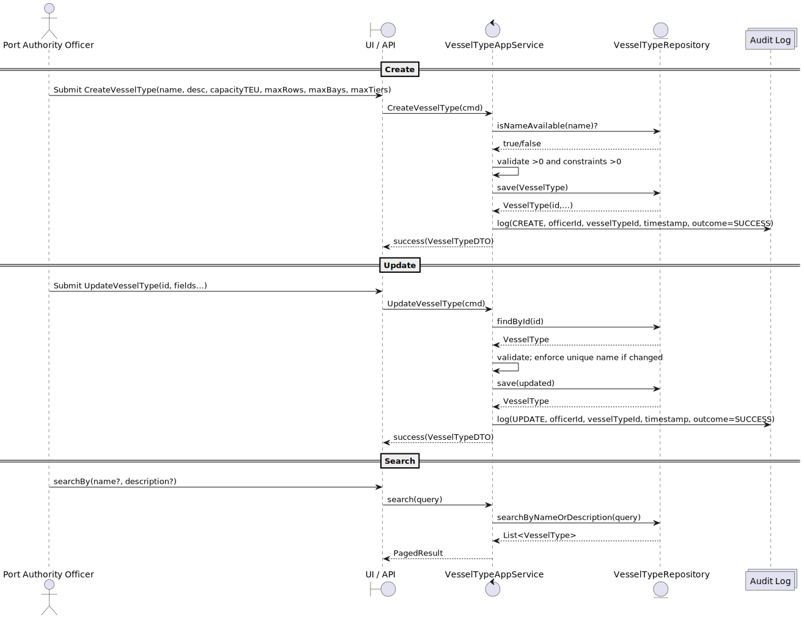

# US2.2.1 - Create and manage vessel types

## 1. Requirements Engineering

### 1.1. User Story Description

> **As a Port Authority Officer,** I want to **create and update vessel types** so that vessels can be **classified consistently** and their **operational constraints** are properly defined.

**Preconditions**

* Officer is authenticated and authorized.
* The “Port Registry” module is available.

**Postconditions**

* A new **VesselType** is persisted or an existing one is updated.
* Vessel types are available for reference when registering vessels.
* Changes are auditable (who/when/what).

---

### 1.2. Customer Specifications and Clarifications

> Vessel types must include **name**, **description**, **capacity (TEU)**, and **operational constraints**: **maxRows**, **maxBays**, **maxTiers**.
> Vessel types must be **searchable/filterable** by **name** and **description**.
> Vessel types are **referenced by Vessel** during registration and validation.
> Names should be **unique** within the registry to avoid ambiguity (e.g., “Panamax-A”, “Feeder-S”).
> Constraints must be **positive integers**; capacity must be **> 0**.
> Updates must **not break referential integrity** (existing vessels can continue referencing the type).

**From forum**

> **Q:** Can two vessel types share the same name if they differ in constraints?
> **A:** No. Enforce **unique name** for clarity in searches and references.
> **Q:** What unit should “capacity” use?
> **A:** **TEU** (Twenty-foot Equivalent Unit).
> **Q:** Are maxRows/Bays/Tiers mandatory?
> **A:** Yes; they express the physical stowage grid (Bay × Row × Tier) used by planners.

---

### 1.3. Acceptance Criteria

* **AC01 – Create:** System allows creating a VesselType with **name, description, capacityTEU, maxRows, maxBays, maxTiers**.
* **AC02 – Update:** System allows updating the fields of an existing VesselType.
* **AC03 – Validation (capacity):** `capacityTEU > 0`; error shown if invalid.
* **AC04 – Validation (constraints):** `maxRows > 0 ∧ maxBays > 0 ∧ maxTiers > 0`; error shown if invalid.
* **AC05 – Uniqueness:** `name` must be **unique** (case-insensitive) across vessel types.
* **AC06 – Search/Filter:** Users can **search** by name and **filter** by name/description substring.
* **AC07 – Reference Availability:** Created/updated VesselTypes are **immediately available** to the Vessel registration UI/API.
* **AC08 – Audit:** Create/Update actions are **logged** with timestamp, officer ID, and action outcome.
* **AC09 – Error Handling:** On validation failure, the user gets **clear, actionable messages**; no partial records.

---

### 1.4. Found out Dependencies

* **Depends on:** Authentication/Authorization (role: Port Authority Officer).
* **Provides to:** US2.2.2 (Vessel registration), which **references VesselType**.
* **Cross-cutting:** Audit/Logging, Search API.

---

### 1.5. Input and Output Data

**Input Data (Create/Update form or API):**

* `name : string` *(required, unique)*
* `description : string` *(optional/required per policy)*
* `capacityTEU : integer > 0`
* `maxRows : integer > 0`
* `maxBays : integer > 0`
* `maxTiers : integer > 0`

**Output Data:**

* On success: persisted **VesselType DTO** (id, all fields, created/updated timestamps).
* On failure: **error list** with field-level messages (e.g., “Capacity must be > 0”, “Name already exists”).
* For search: **paged list** of `{id, name, description, capacityTEU}` with filter metadata.

---

### 1.6. System Sequence Diagram (SSD)

You can render this with PlantUML.

---

### 1.7. Other Relevant Remarks

* **Internationalization:** Names are short; descriptions may require i18n later.
* **Concurrency:** Use optimistic locking on updates to avoid lost updates.
* **Deletion policy (out of scope Sprint 1):** If implemented later, **prevent delete** when referenced by any Vessel; prefer **soft-delete** or **status=inactive**.
* **Testing:** Unit tests for **invariants**; repository tests for **uniqueness**; service tests for **flows**; contract tests for **search**.
