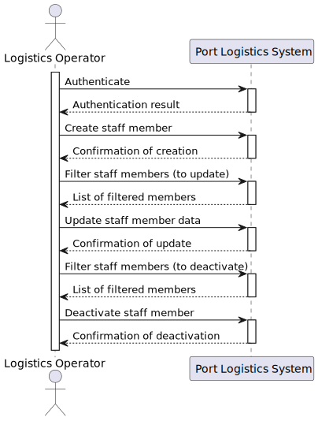

# US 2.2.11 - Register and manage operating staff members

## 1. Requirements Engineering

### 1.1. User Story Description

> As a Logistics Operator, I want to register and manage operational team members (create, update, deactivate) so that the system accurately reflects staff availability and ensures only qualified personnel are assigned to resources during scheduling.

**Preconditions**

- The user is authenticated as a Logistics Operator.
- At least one Qualification is already registered in the system (to assign to the staff member).

**Postconditions**

- Staff members are created, updated, or deactivated while maintaining audit history.

---

### 1.2. Customer Specifications and Clarifications

**From forum**

- >**Q**: In US 2.2.11, the process of updating a staff member is mentioned. With the introduction of this action, a few questions have arisen:
  When updating a staff member, can all previously entered information be modified?
  Is it possible to leave a staff member’s record incomplete — for example, register some information now and complete the rest later — given that this could occur with the update action?
  When a staff member is registered, do they automatically become available (with the status "available")?

- > **A**: The mecanographic number cannot be modified. Everything else might be modified.  
  When registering a staff member, they must be, by default, available.  
  Mandatory information includes the mecanographic number, short name, contacts, and status.
  

### 1.3. Acceptance Criteria

* **AC01** – Each team member must have a unique staff number, short name, contacts (email, phone), qualifications, operational window, and current status (e.g., available, unavailable).
* **AC02** – Deactivation/reactivation should not delete data but preserve it for auditing and historical planning.
* **AC03** – Members must be searchable and filterable by ID, name, status, and qualifications.

---

### 1.4. Found out Dependencies

- Qualification management (qualifications must be pre-registered).
- Resource module, as only qualified staff can be assigned to certain resources.

---

### 1.5. Input and Output Data

**Input Data (Create/Update form or API):**

- Staff number (unique ID, unmodifiable after creation)
- Short name
- Email, phone
- List of associated qualifications
- Operational window (availability periods)
- Status (available by default on registration, can be updated later)

**Output Data:**

- Filterable/searchable lists of members with key fields
- Detailed staff data (including status and qualifications)

---

### 1.6. System Sequence Diagram (SSD)

---

### 1.7. Other Relevant Remarks

- Importance of not deleting  requires "soft delete" logic, facilitating auditing.
- Only staff with "available" status can be assigned in future schedules.

