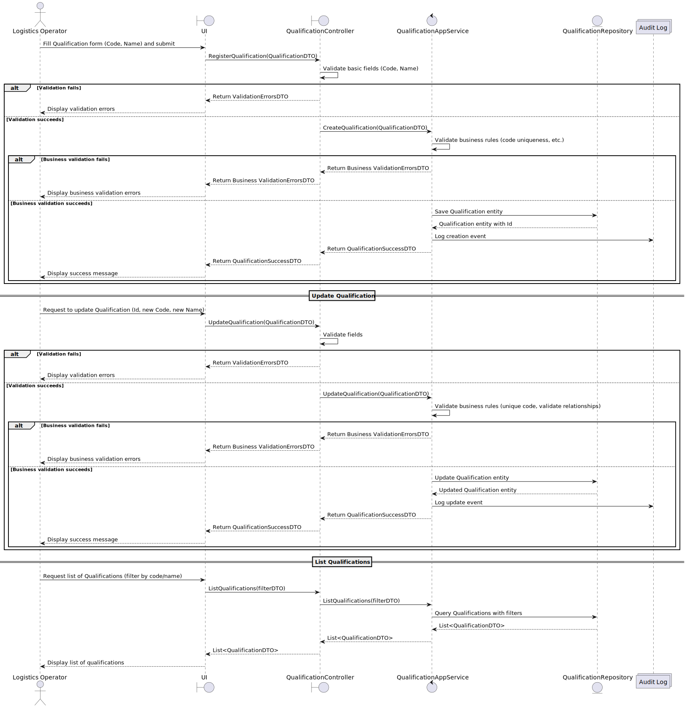

# US 2.2.13 – Register and Manage Qualifications

## 3. Design – User Story Realization

### 3.1. Rationale

This design section explains how the core functionality of registering, updating, and listing qualifications will be realized from the perspective of user interaction with the system. It focuses on the coordination of application layers — UI, Controller, Service, Repository — and how data is validated, processed, persisted, and audited throughout this process.

The aim is to ensure clear separation of concerns, robust error handling, data integrity maintenance, and a workflow that is straightforward for the logistics operator to use.

The design reflects best practices for building maintainable, testable, and scalable applications by explicitly defining responsibilities and interactions between layers.

---

### 3.2. Sequence Diagram (SD)

This section provides three distinct sequence diagrams (in one), representing the main CRUD operations involved in this user story:

1. **Create**: The process of registering a new Qualification. This includes validation of input fields (code, name) provided by the user, saving the new entity in the database, and recording audit logs to track the creation event.

2. **Update**: The process for modifying an existing Qualification's data. It involves validating the changed data, ensuring that the qualification code remains unique, persisting the updates, and logging the changes for auditing purposes.

3. **List**: The procedure to retrieve and filter Qualifications by code or name, returning the filtered list to the user interface.

These diagrams offer a precise technical blueprint to guide the implementation and testing of this user story, promoting clarity, consistency, and a thorough understanding among development team members.
