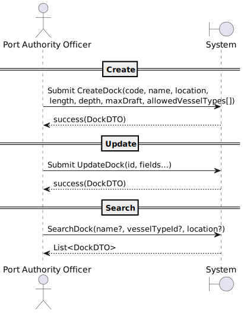

# US2.2.3 – Register and update docks

## 1. Requirements Engineering

### 1.1. User Story Description

> As a Port Authority Officer, I want to register and update docks so that the system accurately reflects the docking capacity of the port.

**Preconditions**

* Officer is authenticated and authorized.
* The “Port Registry” module is available.
* At least one VesselType exists (for berth constraints).

**Postconditions**

* A new **Dock** is persisted or an existing one is updated.
* Docks are available for reference when assigning vessel visits.
* Changes are auditable (who/when/what).

---

### 1.2. Customer Specifications and Clarifications

**From forum**

> **Q:** Regarding this user story, can you confirm if a dock supports only one vessel type?
> 
> **A:** No! That is clearly wrong.
An acceptance criteria states that "The officer must specify the vessel types allowed to berth there.".
On a given dock may berth several vessel types (e.g. Feeder and Panamax).

> **Q** Regarding the user story for registering and updating a dock, we are not sure what is meant by "location within the port." Should this be stored as geographic coordinates, or as a relative/semantic position (e.g., area, zone) within the port?
> 
> **A** In this case, you may consider the "location within the port" as a free text.
---

### 1.3. Acceptance Criteria

* **AC01 – Create: System allows creating a Dock with all required attributes.
* **AC02 – Update: System allows updating Dock fields (including allowed VesselTypes).
* **AC03 – Uniqueness: Dock identifier and name must be unique within the port.
* **AC04 – Validation (dimensions): length > 0, depth > 0, maxDraft > 0; error shown if invalid.
* **AC05 – Reference Availability: Created/updated docks are immediately available for Vessel Visit assignment.
* **AC06 – Search/Filter: Users can search docks by name and filter by vessel type and location.
* **AC07 – Referential Integrity: Updates must not invalidate existing Vessel Visit assignments.
* **AC08 – Audit: Create/Update actions are logged with timestamp, officer ID, and action outcome.
* **AC09 – Error Handling: On validation failure, the user gets clear, actionable messages; no partial records.

---

### 1.4. Found out Dependencies

* **Depends on:** Authentication/Authorization (role: Port Authority Officer).
* **Provides to:** Vessel Visit Scheduling (dock assignment).
* **Cross-cutting:** Audit/Logging, Search API.

---

### 1.5. Input and Output Data

**Input Data (Create/Update form or API):**

* `dockId : string` *(required, unique)*
* `name : string` *(required, unique)*
* `location : string` *(required)*
* `length : number > 0`
* `depth : number > 0`
* `maxDraft : number > 0`
* `allowedVesselTypes : [VesselTypeId]`

**Output Data:**

* On success: persisted Dock DTO (id, all fields, created/updated timestamps).
* On failure: error list with field-level messages (e.g., “Name already exists”, “Depth must be > 0”).
* For search: paged list of {id, name, location, allowedVesselTypes} with filter metadata.

---

### 1.6. System Sequence Diagram (SSD)

