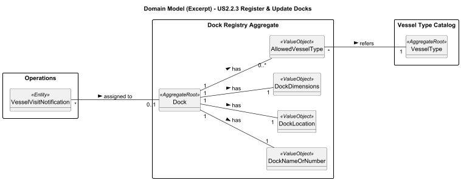

# US2.2.3 – Register and update docks

## 2. Analysis

### 2.1. Relevant Domain Model Excerpt

---

### 2.2. Other Remarks

* Dock acts as master data, being reused across several use cases, mainly during Vessel Visit approval (dock assignment).
* Referential integrity: updating a Dock must not break existing Vessel Visits assigned to it. Potential conflicts (removing an allowed VesselType) should be prevented or flagged for resolution.
* Search/filter is implemented in the Application Service + Repository (by name, vessel type, location), not in the Aggregate itself.
* Deletion is not addressed in this sprint. Future implementations should consider soft-delete or a status field to preserve history and auditability.
* Audit logging is treated as a cross-cutting concern (create/update actions logged with timestamp, actor, and outcome).
* Units & fields: length, depth, and maxDraft are expressed in meters; location is stored as free text as clarified by the customer; allowedVesselTypes must reference existing VesselTypes.
* Indexes recommended (non-functional): name (unique), location (for filtering), and a composite index (vesselTypeId, name) to optimize search queries.
* Planning preparation: while this US does not manage resources, docks should remain consistent with physical constraints that affect planning (number of STS cranes per dock, captured in other modules).

