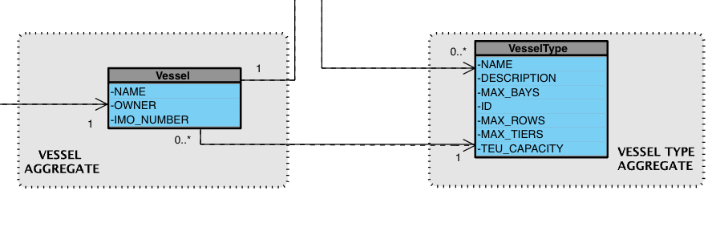

# US2.2.1 - Create and manage vessel types

## 2. Analysis

### 2.1. Relevant Domain Model Excerpt

---

### 2.2. Other Remarks

* **VesselType** serves as **master data**, being reused across multiple use cases (e.g., Vessel creation – US2.2.2).
* Creation/update must ensure that **existing references in Vessel are not broken**.
* **Search/filter** is implemented in the **Application Service + Repository**, not in the Aggregate itself.
* For simplification, deletion is **not addressed in this sprint**; in the future, it may be implemented as **soft-delete** or `status`.
* Associations with the **audit log** are handled as a **cross-cutting concern**.

