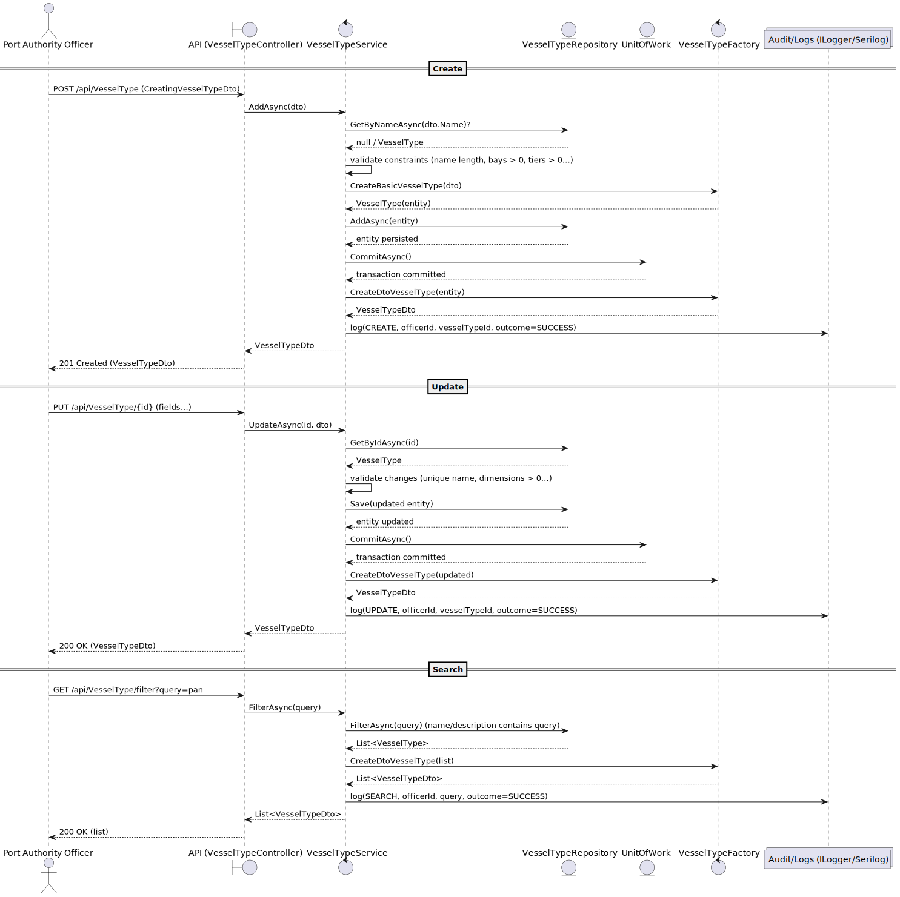
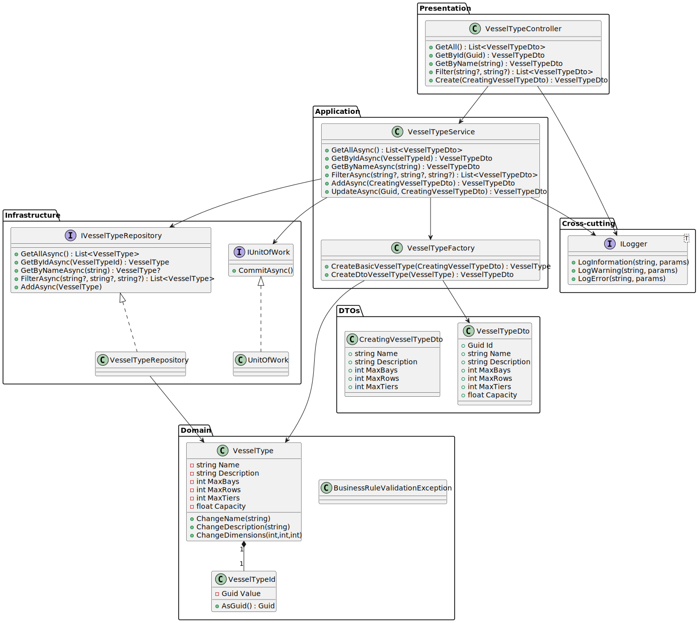

# US2.2.1 – Create and manage vessel types

## 3. Design – User Story Realization

### 3.1. Rationale

This section explains **which software class takes responsibility** for each interaction step, following the SSD (System Sequence Diagram) defined in the analysis.

| Interaction ID                                              | Question: Which class is responsible for... | Answer                                | Justification (with patterns)                                                                                       |
| ----------------------------------------------------------- | ------------------------------------------- | ------------------------------------- | ------------------------------------------------------------------------------------------------------------------- |
| Step 1: Officer submits “Create VesselType”                 | …interacting with the actor?                | `VesselTypeController`                | **Controller** pattern: centralizes input handling from UI/API.                                                     |
|                                                             | …coordinating the US?                       | `VesselTypeService`                   | **Application Service**: orchestrates domain logic and delegates to the domain model + repository + factory.        |
| Step 2: request data (name, description, constraints, etc.) | …validating business rules?                 | `VesselType` (Aggregate Root)         | **Information Expert**: only the aggregate enforces its invariants (capacity > 0, constraints > 0, unique name).    |
|                                                             | …transforming DTOs into Entities/DTOs?      | `VesselTypeFactory`                   | **Factory**: centralizes creation of entities and DTOs, avoiding duplication of conversion logic.                   |
| Step 3: persist VesselType                                  | …storing/retrieving VesselType?             | `VesselTypeRepository` + `UnitOfWork` | **Repository**: abstracts persistence and provides access to aggregates. **UnitOfWork**: guarantees atomic commits. |
| Step 4: log action                                          | …recording audit trail?                     | `ILogger` (Serilog)                   | **Pure Fabrication**: dedicated logging mechanism for cross-cutting concerns (audit, monitoring, debugging).        |

**Systematization**
According to this rationale, the conceptual classes promoted to software classes are:

* `VesselType` (Aggregate Root)

Other software classes (i.e., Pure Fabrication) identified:

* `VesselTypeController`
* `VesselTypeService`
* `VesselTypeFactory`
* `VesselTypeRepository`
* `UnitOfWork`
* `ILogger` (logging / audit)

---

### 3.2. Sequence Diagram (SD)
This diagram illustrates the interactions between the classes for realizing the user story.

**Full Diagram:**

---

### 3.3. Class Diagram (CD)
The class diagram for this US includes:

* `VesselType` (Aggregate Root with attributes: name, description, capacityTEU, maxRows, maxBays, maxTiers).
* `VesselTypeController` (handles requests from UI/API).
* `VesselTypeAppService` (application service orchestrating use case).
* `VesselTypeRepository` (persistence abstraction).
* `AuditService` (responsible for audit logging).

