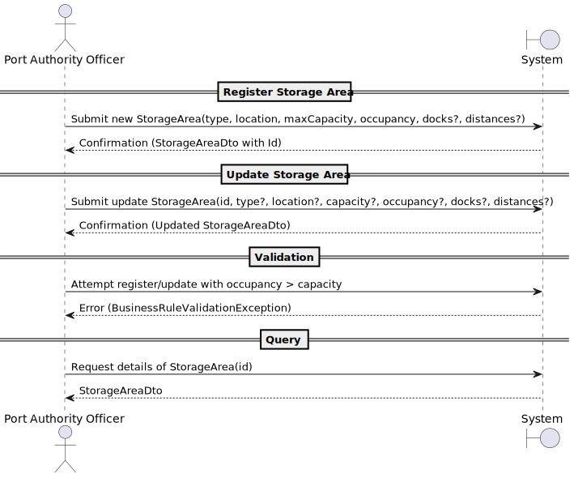

# US2.2.4 – Register and update storage areas

## 1. Requirements Engineering

### 1.1. User Story Description

**As a Port Authority Officer, I want to register and update storage areas, so that (un)loading and storage operations can be assigned to the correct locations.**

---

### 1.2. Customer Specifications and Clarifications

**From the specifications document and client meetings:**

* Each storage area must have:

    * A unique identifier.
    * Type (e.g., yard, warehouse).
    * Location within the port.
* Must specify **maximum capacity (in TEUs)** and **current occupancy**.
* By default, a storage area serves the **entire port** (all docks).
* Some storage areas (e.g., yards) may be constrained to **specific docks** (usually the closest).
* Complementary information (distances between docks and storage areas) must be manually recorded.
* Updates must not allow current occupancy > maximum capacity.

**From forum:**

> **Question:** Can storage areas serve multiple docks?
> **Answer:** Yes, but only some (e.g., yards).

---

### 1.3. Acceptance Criteria

* **AC01:** A storage area must have a unique identifier.
* **AC02:** Type and location must be mandatory.
* **AC03:** Occupancy cannot exceed maximum capacity.
* **AC04:** By default, storage areas serve all docks, but yards can be restricted to a subset.
* **AC05:** Distances between docks and storage areas must be recorded manually.
* **AC06:** Officer must be able to register a new storage area (POST).
* **AC07:** Officer must be able to update details of an existing storage area (PUT/PATCH).
* **AC08:** System must reject updates that violate business rules (e.g., occupancy > capacity).

---

### 1.4. Found out Dependencies

* Depends on the **Dock management module** (to link docks to storage areas).
* Depends on the **Audit logging system** (to register who updated/created a storage area).

---

### 1.5 Input and Output Data

**Input Data:**

* Storage Area details:

    * Identifier (system-generated).
    * Type (yard/warehouse).
    * Location.
    * Maximum Capacity (TEUs).
    * Current Occupancy.
    * Assigned docks (optional).
    * Distances (dock → area).

**Output Data:**

* Confirmation message (success/failure).
* StorageAreaDto containing registered/updated details.

---

### 1.6. System Sequence Diagram (SSD)

---

### 1.7 Other Relevant Remarks

* This US relates closely to **future logistics optimization** (where distances will be relevant).
* Data integrity rules must be enforced at the **domain level** (Aggregate Root `StorageArea`).
* Audit log must capture every create/update action.

---