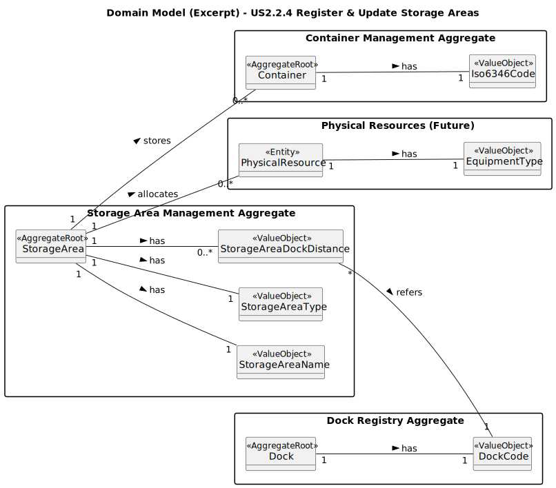

# US2.2.4 – Register and Update Storage Areas

## 2. Analysis

### 2.1. Relevant Domain Model Excerpt

### 2.2. Other Remarks

* The validation logic (e.g., **occupancy ≤ maxCapacity**) is implemented in the **Aggregate Root `StorageArea`**, ensuring business integrity.
* The association to `Dock` is optional, but if it exists, **each distance must be unique per `DockCode`**.
* The excerpt shown is only a partial view focused on US2.2.4 (it does not include all entities of the port).