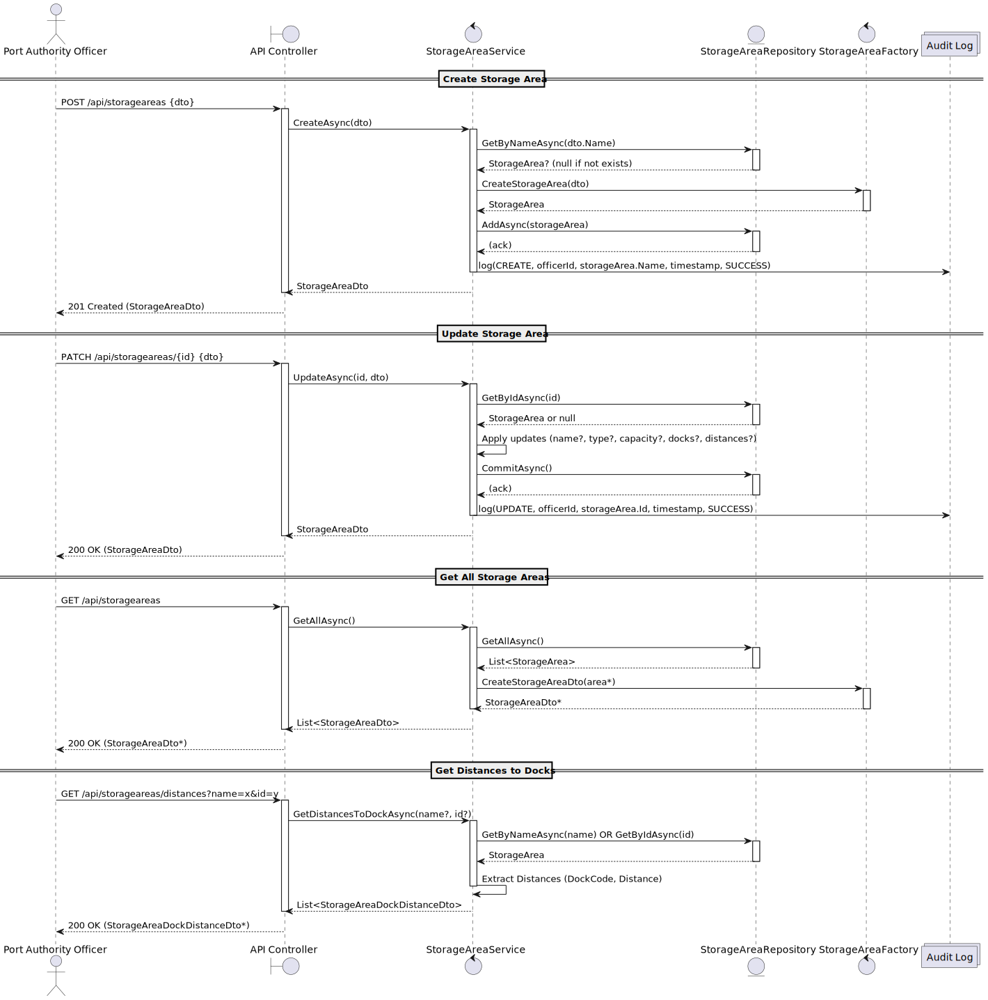
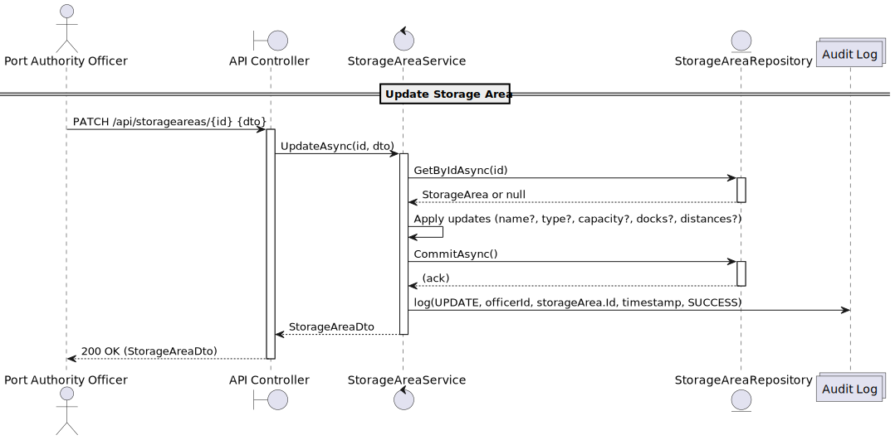
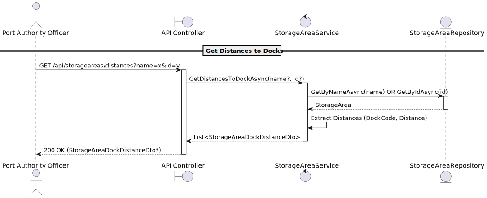
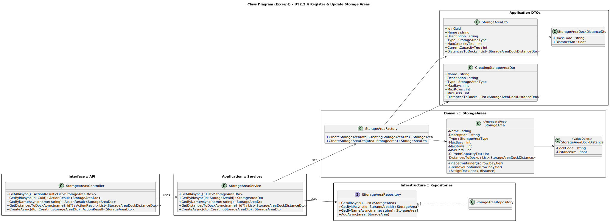

# US2.2.4 – Register and Update Storage Areas

## 3. Design - User Story Realization

### 3.1. Rationale

***Note that SSD – Alternative One is adopted.***

| Interaction ID | Question: Which class is responsible for...                  | Answer                        | Justification (with patterns)                                                                                |
| :------------- | :----------------------------------------------------------- | :---------------------------- | :----------------------------------------------------------------------------------------------------------- |
| Step 1         | … interacting with the actor?                                | `StorageAreasController`      | **Controller pattern**: it handles API requests and delegates work to the application/service layer.         |
| Step 2         | … coordinating the User Story (application flow)?            | `StorageAreaService`          | **Application Service**: coordinates business logic and enforces rules before interacting with repositories. |
| Step 3         | … creating the domain object (`StorageArea`)?                | `StorageAreaFactory`          | **Factory pattern**: centralizes creation logic for `StorageArea` and its DTOs.                              |
| Step 4         | … enforcing business rules (e.g., occupancy ≤ max capacity)? | `StorageArea` (AggregateRoot) | **Domain Model / Aggregate Root**: ensures invariants and encapsulates validation logic.                     |
| Step 5         | … persisting and retrieving storage areas?                   | `IStorageAreaRepository`      | **Repository pattern**: abstracts persistence and ensures aggregate consistency.                             |
| Step 6         | … handling transaction management?                           | `IUnitOfWork`                 | **Unit of Work pattern**: ensures atomic operations across repositories.                                     |

### Systematization

According to the rationale above, the conceptual classes promoted to software classes are:

* `StorageAreasController`
* `StorageAreaService`
* `StorageAreaFactory`

Other software classes (i.e. Pure Fabrication) identified:

* `StorageAreaDto`, `CreatingStorageAreaDto`, `UpdatingStorageAreaDto`

---

## 3.2. Sequence Diagram (SD)

### Full Diagram

This diagram shows the full sequence of interactions between the classes involved in the realization of this user story.

### Split Diagrams

The following diagrams illustrate the same interactions, split for readability.

**Get All**

**Register Storage Area**

**Update Storage Area**

**Get Distances**

---

## 3.3. Class Diagram (CD)

