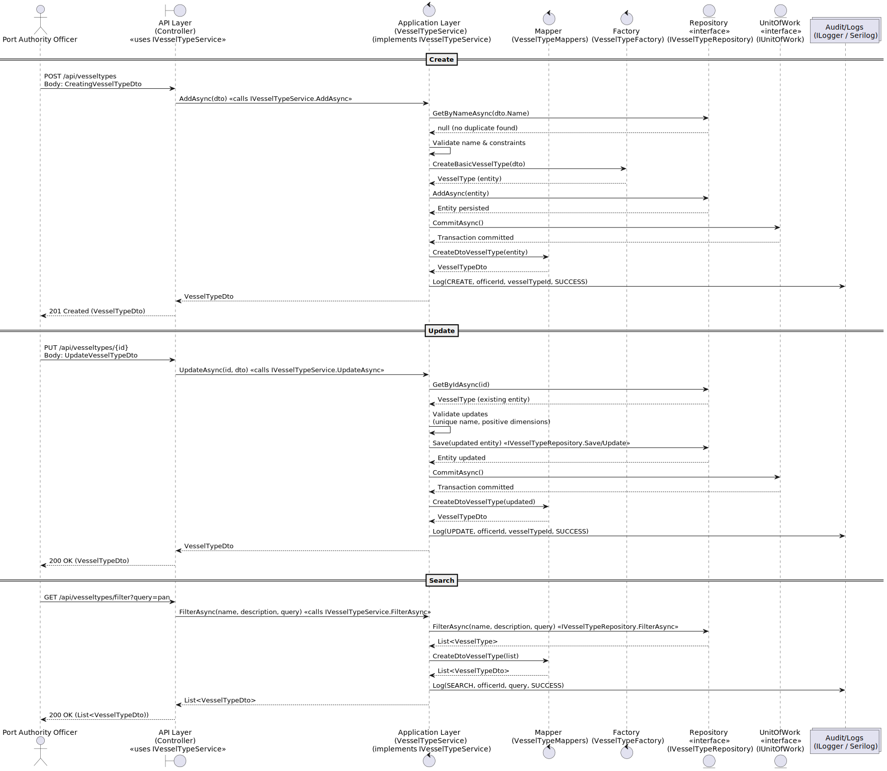
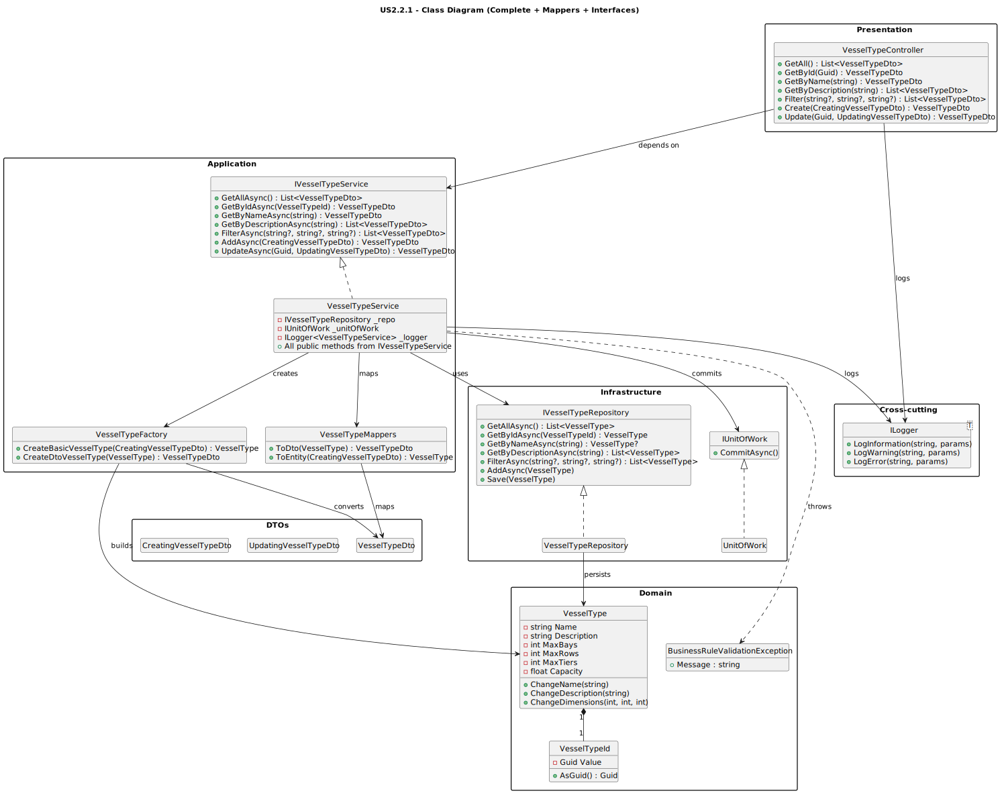

# **US2.2.1 – Create and Manage Vessel Types**

## **3. Design – User Story Realization**

### **3.1. Rationale**

This section identifies which software class is responsible for each interaction defined in the **System Sequence Diagram** (SSD) from the analysis phase.
The allocation of responsibilities follows the **GRASP** and **GoF** design patterns.

| **Interaction ID**                                        | **Question: Which class is responsible for…** | **Answer**                                 | **Justification (with design pattern)**                                                                                         |
| --------------------------------------------------------- | --------------------------------------------- | ------------------------------------------ | ------------------------------------------------------------------------------------------------------------------------------- |
| **Step 1:** Officer submits “Create/Update VesselType”    | …interacting with the actor?                  | `VesselTypeController`                     | **Controller Pattern:** Handles HTTP/API requests from external actors, translating them into application service calls.        |
|                                                           | …coordinating the use case?                   | `IVesselTypeService` / `VesselTypeService` | **Application Service:** Orchestrates the business workflow, delegating domain validation and persistence to other layers.      |
| **Step 2:** Request data (name, description, constraints) | …validating business rules?                   | `VesselType` (Aggregate Root)              | **Information Expert / Entity Pattern:** Encapsulates domain invariants (e.g., unique name, positive dimensions).               |
|                                                           | …transforming between DTOs and Entities?      | `VesselTypeFactory`                        | **Factory Pattern:** Centralizes the creation of domain objects and DTOs, ensuring consistency and isolation from constructors. |
| **Step 3:** Persist VesselType                            | …storing/retrieving VesselType data?          | `VesselTypeRepository` + `UnitOfWork`      | **Repository Pattern:** Abstracts data access; **Unit of Work:** Coordinates atomic transactions and commits.                   |
| **Step 4:** Log action                                    | …recording audit or monitoring information?   | `ILogger` (e.g., Serilog)                  | **Pure Fabrication / Cross-cutting Concern:** Dedicated component for audit, debugging, and monitoring.                         |

---

### **Systematization**

From the above rationale, the conceptual and supporting software classes are:

**Domain Layer**

* `VesselType` (Aggregate Root)
* `VesselTypeId` (Value Object)
* `BusinessRuleValidationException` (Domain Exception)

**Application Layer**

* `IVesselTypeService` / `VesselTypeService` (Application Service)
* `VesselTypeFactory` (Factory)
* `VesselTypeMappers` (DTO ↔ Entity mapping)

**Infrastructure Layer**

* `IVesselTypeRepository` / `VesselTypeRepository`
* `IUnitOfWork` / `UnitOfWork`

**Presentation Layer**

* `VesselTypeController` (API endpoint)

**Cross-Cutting**

* `ILogger` (Audit / Logging)

---

### **3.2. Sequence Diagram (SD)**

The following sequence diagram illustrates the dynamic interactions among components during the “Create”, “Update”, and “Search” operations of the user story.

**Full Diagram:**

---

### **3.3. Class Diagram (CD)**

The class diagram represents the structural organization of the components participating in this user story, according to the **DDD Layered Architecture** (Presentation → Application → Domain → Infrastructure).

**Main Elements:**

* `VesselType` — Aggregate Root defining core attributes and business rules.
* `CreatingVesselTypeDto`, `UpdatingVesselTypeDto`, `VesselTypeDto` — Data Transfer Objects for inter-layer communication.
* `IVesselTypeService` / `VesselTypeService` — Application Service responsible for orchestrating the use case logic.
* `VesselTypeFactory` and `VesselTypeMappers` — Support consistent conversion between DTOs and Domain Entities.
* `IVesselTypeRepository` / `VesselTypeRepository` and `IUnitOfWork` — Handle persistence and transactional control.
* `VesselTypeController` — Exposes REST API endpoints to external clients.
* `ILogger` — Logs operations for audit and traceability.

**Diagram:**

