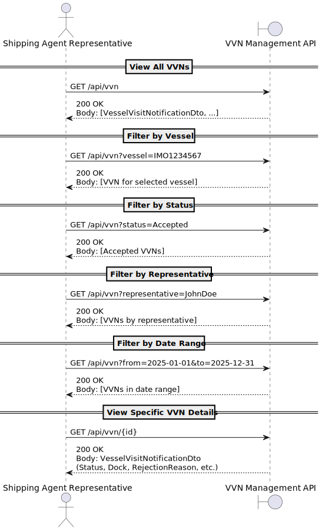

# **US2.2.10 – View Vessel Visit Notification Status**

## **1. Requirements Engineering**

---

### **1.1. User Story Description**

> **As a Shipping Agent Representative**,
> I want to **view the status of all my submitted Vessel Visit Notifications**
> (in progress, pending, accepted, submitted, or withdrawn),
> so that I am always informed about the state of my organization’s visits.

---

### **1.2. Customer Specifications and Clarifications**

**From the client specifications and meetings:**

> The system must allow a **Shipping Agent Representative (SAR)** to view the status of all Vessel Visit Notifications (VVNs) created either by themselves or by other representatives within the same **Shipping Agent Organization (SAO)**.

> The SAR should be able to filter results by multiple parameters such as:
>
> * Specific representative
> * Vessel IMO number
> * Estimated Time of Arrival (ETA)
> * Estimated Time of Departure (ETD)
> * Submitted or Accepted dates (depending on status)

> The filters are applied **server-side**, and the results are returned as a list of structured DTOs.

---

### **1.3. Acceptance Criteria**

| **ID**   | **Description**                                                                                                                     |
| :------- | :---------------------------------------------------------------------------------------------------------------------------------- |
| **AC01** | A SAR can list all VVNs created by themselves or by other representatives within the same organization.                             |
| **AC02** | The system returns the following data: VVN Code, Vessel IMO, ETA, ETD, Status, Assigned Dock, and (if applicable) Rejection Reason. |
| **AC03** | The system supports filters for IMO number, representative, ETA, ETD, Submitted Date, and Accepted Date.                            |
| **AC04** | Only VVNs belonging to the same SAO as the logged SAR are displayed.                                                                |
| **AC05** | The status filters include InProgress, PendingInformation, Submitted, Accepted, and Withdrawn.                                      |
| **AC06** | The result is returned as a list of `VesselVisitNotificationDto` objects in JSON format.                                            |

---

### **1.4. Dependencies**

* Depends on:

    * **VesselVisitNotificationRepository** – to retrieve VVNs by code.
    * **ShippingAgentRepresentativeRepository** – to identify all SARs within the same SAO.
    * **ShippingAgentOrganizationRepository** – to verify organizational ownership.
    * **VesselRepository** – to validate vessel IMO numbers.
* Related to:

    * **US2.2.8 – Create VVN**
    * **US2.2.9 – Update/Submit VVN**

---

### **1.5. Input and Output Data**

#### **Input Data**

Each status type has a specific filter DTO:

* **In Progress / Pending Information**

  ```json
  {
    "specificRepresentative": "GUID?",
    "vesselImoNumber": "IMO1234567",
    "estimatedTimeArrival": "2025-04-01T09:00:00Z",
    "estimatedTimeDeparture": "2025-04-01T18:00:00Z"
  }
  ```

* **Submitted**

  ```json
  {
    "specificRepresentative": "GUID?",
    "vesselImoNumber": "IMO1234567",
    "estimatedTimeArrival": "2025-04-01T09:00:00Z",
    "estimatedTimeDeparture": "2025-04-01T18:00:00Z",
    "submittedDate": "2025-03-31T10:30:00Z"
  }
  ```

* **Accepted**

  ```json
  {
    "specificRepresentative": "GUID?",
    "vesselImoNumber": "IMO1234567",
    "estimatedTimeArrival": "2025-04-01T09:00:00Z",
    "estimatedTimeDeparture": "2025-04-01T18:00:00Z",
    "submittedDate": "2025-03-31T10:30:00Z",
    "acceptedDate": "2025-04-01T11:00:00Z"
  }
  ```

* **Withdrawn**

  ```json
  {
    "specificRepresentative": "GUID?",
    "vesselImoNumber": "IMO1234567",
    "estimatedTimeArrival": "2025-04-01T09:00:00Z",
    "estimatedTimeDeparture": "2025-04-01T18:00:00Z"
  }
  ```

#### **Output Data**

A list of `VesselVisitNotificationDto` objects:

```json
[
  {
    "code": "2025-000123",
    "vesselImo": "IMO9876543",
    "estimatedTimeArrival": "2025-05-02T08:00:00Z",
    "estimatedTimeDeparture": "2025-05-02T18:00:00Z",
    "status": "Accepted",
    "assignedDock": "DK-0001",
    "rejectionReason": null
  }
]
```

---

### **1.6. System Sequence Diagram (SSD)**



