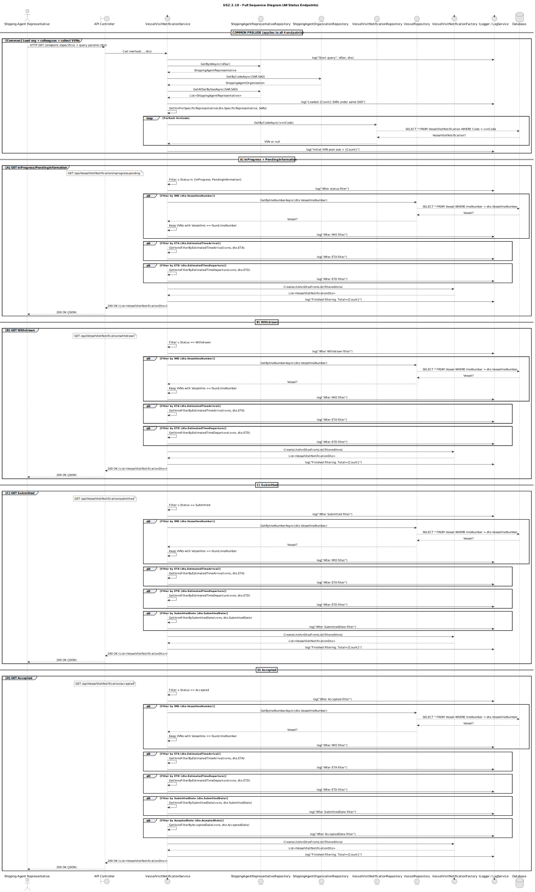
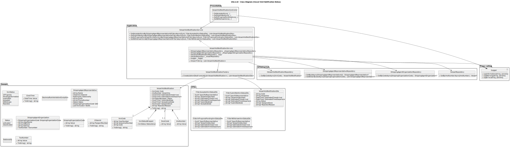

# **US2.2.10 – View Vessel Visit Notification Status**

## **3. Design – User Story Realization**

---

### **3.1. Rationale**

***Note that SSD – Alternative One is adopted.***

| **Interaction ID** | **Question: Which class is responsible for...**                   | **Answer**                              | **Justification (with patterns)**                                                                                                        |
| :----------------- | :---------------------------------------------------------------- | :-------------------------------------- | :--------------------------------------------------------------------------------------------------------------------------------------- |
| **Step 1:**        | ... interacting with the actor (Shipping Agent Representative)?   | `VesselVisitNotificationController`     | **Pure Fabrication:** there is no reason to assign this responsibility to a Domain class. The Controller handles external HTTP requests. |
|                    | ... coordinating the US flow and delegating logic?                | `VesselVisitNotificationService`        | **Controller pattern:** the Service coordinates all steps, applying domain logic, validation, and calling repositories.                  |
| **Step 2:**        | ... retrieving all representatives from the same organization?    | `ShippingAgentRepresentativeRepository` | **Information Expert:** the repository knows how to access the data of representatives.                                                  |
| **Step 3:**        | ... loading the VVNs associated to these representatives?         | `VesselVisitNotificationRepository`     | **Information Expert:** the repository provides access to VVNs by their codes.                                                           |
| **Step 4:**        | ... filtering by IMO, ETA, ETD, Submitted or Accepted dates?      | `VesselVisitNotificationService`        | **Controller:** applies filtering and validation logic before returning data to the API.                                                 |
| **Step 5:**        | ... converting domain entities into DTOs to return to the client? | `VesselVisitNotificationFactory`        | **Factory pattern:** converts Domain Entities into `VesselVisitNotificationDto` objects.                                                 |
| **Step 6:**        | ... returning the JSON list of VVNs to the actor?                 | `VesselVisitNotificationController`     | **Pure Fabrication:** the Controller serializes the final data and sends it in the API response.                                         |

---

### **Systematization**

According to the taken rationale, the conceptual classes promoted to software classes are:

* **`VesselVisitNotificationService`** (Application Layer)
* **`VesselVisitNotificationController`** (Interface Layer)

Other software classes (Pure Fabrication) identified:

* **`VesselVisitNotificationFactory`** – responsible for converting domain entities to DTOs.
* **DTO classes:**

    * `FilterInProgressPendingVvnStatusDto`
    * `FilterSubmittedVvnStatusDto`
    * `FilterAcceptedVvnStatusDto`
    * `FilterWithdrawnVvnStatusDto`
    * `VesselVisitNotificationDto`

---

## **3.2. Sequence Diagram (SD)**

### **Full Diagram**

This diagram shows the full sequence of interactions between the classes involved in the realization of this user story.

### **Sequence Flow Description (Textual)**

1. The **Shipping Agent Representative (SAR)** requests `/api/VesselVisitNotification/status?status=Accepted&imo=IMO1234567`.
2. The **`VesselVisitNotificationController`** receives the HTTP GET and delegates to **`VesselVisitNotificationService`**.
3. The **Service** retrieves all representatives belonging to the same **ShippingAgentOrganization** via **`ShippingAgentRepresentativeRepository`**.
4. It then collects the VVNs associated with those representatives using **`VesselVisitNotificationRepository`**.
5. Depending on the request, it filters results by:

    * `VesselImoNumber`
    * `EstimatedTimeArrival`
    * `EstimatedTimeDeparture`
    * `SubmittedDate`
    * `AcceptedDate`
6. The filtered list is converted into DTOs using **`VesselVisitNotificationFactory`**.
7. The **Controller** returns the list of `VesselVisitNotificationDto` objects to the client as JSON.

---

## **3.3. Class Diagram (CD)**

---

### **Class Relationships Summary**

| **Class**                                                                                                                               | **Type**            | **Responsibility**                                       |
| :-------------------------------------------------------------------------------------------------------------------------------------- | :------------------ | :------------------------------------------------------- |
| `VesselVisitNotificationController`                                                                                                     | Controller          | Handles HTTP requests and sends responses.               |
| `VesselVisitNotificationService`                                                                                                        | Application Service | Core coordinator; applies business logic and filtering.  |
| `VesselVisitNotificationRepository`                                                                                                     | Repository          | Provides access to stored VVNs by code.                  |
| `ShippingAgentRepresentativeRepository`                                                                                                 | Repository          | Retrieves representatives belonging to a specific SAO.   |
| `ShippingAgentOrganizationRepository`                                                                                                   | Repository          | Fetches organization data by code.                       |
| `VesselRepository`                                                                                                                      | Repository          | Validates vessel IMO numbers for filters.                |
| `VesselVisitNotificationFactory`                                                                                                        | Factory             | Converts domain entities into DTOs for client responses. |
| `VesselVisitNotificationDto`                                                                                                            | DTO                 | Represents the data returned to the client.              |
| `FilterAcceptedVvnStatusDto` `FilterSubmittedVvnStatusDto` `FilterInProgressPendingVvnStatusDto` `FilterWithdrawnVvnStatusDto` | DTOs                | Contain query filter parameters per status type.         |

---

### **Key Design Patterns Used**

| **Pattern**                    | **Applied In**                      | **Purpose**                                           |
| ------------------------------ | ----------------------------------- | ----------------------------------------------------- |
| **Controller**                 | `VesselVisitNotificationController` | Handles incoming requests and delegates logic.        |
| **Service Layer**              | `VesselVisitNotificationService`    | Encapsulates business logic and orchestration.        |
| **Repository**                 | Domain Repositories                 | Manages persistence and querying of entities.         |
| **Factory**                    | `VesselVisitNotificationFactory`    | Builds DTOs from domain entities.                     |
| **DTO (Data Transfer Object)** | Filter and VVN DTOs                 | Simplifies and structures data exchange with clients. |

---