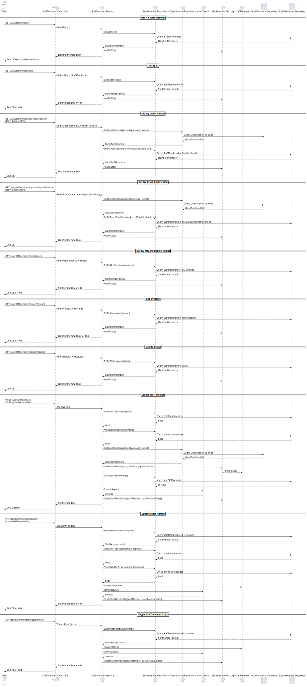

# US2.2.11 – Register and manage operating staff members

## 3. Design – User Story Realization

### 3.1. Rationale

This design section explains how the core functionality of registering, updating, and deactivating operating staff members will be realized from the perspective of user interaction with the system. It focuses on the coordination of application layers — UI, Controller, Service, Repository — and how data is validated, processed, persisted, and audited throughout this process.

The aim is to ensure clear separation of concerns, robust error handling, data integrity maintenance, and a workflow that is straightforward for the logistics operator to use.

The design reflects best practices for building maintainable, testable, and scalable applications by explicitly defining responsibilities and interactions between layers.

---

### 3.2. Sequence Diagram (SD)

This section provides a single consolidated sequence diagram representing all main CRUD operations involved in the use case: create, update, and toggle status (soft delete/reactivate) for operating staff members.

The diagram illustrates method calls and data flow across system layers, highlighting decision points and ensuring that business rules and validations are enforced systematically.

---

### 3.3. Diagram Overview

- **Create Staff Member**: Involves receiving a creation request, validating email and phone uniqueness, generating a unique mecanographic number, loading qualifications, creating the domain entity, persisting it, and returning the created DTO.
- **Update Staff Member**: Retrieves existing staff by mecanographic number, validates new data for uniqueness, updates properties and qualifications according to provided instructions, commits changes, and returns the updated DTO.
- **Toggle Status**: Retrieves staff member by mecanographic number, switches their active status (soft delete/reactivate), commits transaction, and returns the updated DTO.

This unified diagram provides a precise technical blueprint to guide implementation and testing, promoting clarity, consistency, and comprehensive understanding among developers.
