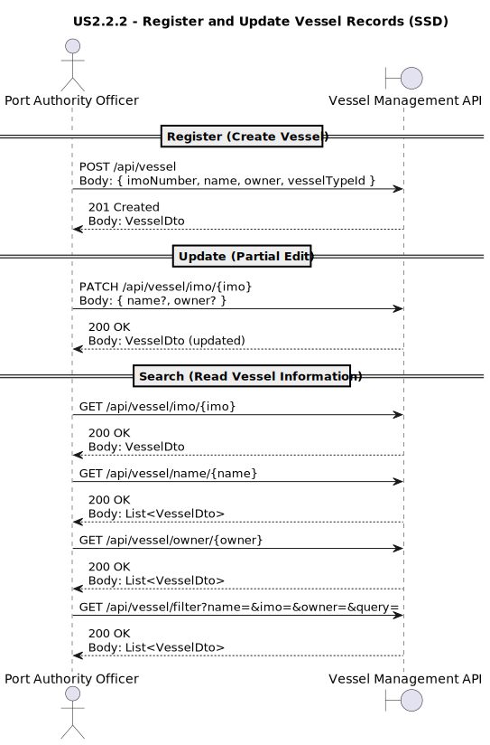

# **US2.2.2 – Register and Update Vessel Records**

## 1. Requirements Engineering

---

### **1.1. User Story Description**

> As a **Port Authority Officer**,
> I want to **register and update vessel records**,
> so that **valid vessels can be referenced in Vessel Visit Notifications (VVNs)**.

**Preconditions**

* Officer must be authenticated with appropriate permissions.
* `VesselType` entities must exist (created in **US2.2.1**).

**Postconditions**

* Vessel data is persisted with a unique IMO number.
* Vessels are available for reference by other subsystems (e.g., VVN registration).
* Updates to vessel information (name, owner) are recorded and auditable.

---

### **1.2. Customer Specifications and Clarifications**

**From the specifications document and client meetings:**

* Each **Vessel Record** must contain:

  * `IMO number` – unique, validated according to ISO 8217 format (`IMO #######`).
  * `Vessel name` – string, minimum 5 characters.
  * `Vessel type` – must reference a valid existing `VesselType`.
  * `Owner/operator` – string, identifying the company or individual owner.

* **IMO Number Validation Rules:**

  * Must be 7 digits.
  * The 7th digit is a **check digit** calculated via weighted sum validation.
  * Must allow both formats: `"IMO 1234567"` and `"1234567"`.
  * Invalid formats (letters, wrong checksum, or incorrect length) must be rejected.

* **Editing Policy:**

  * Only **vessel name** and **owner/operator** are editable.
  * **IMO number** cannot be modified after registration.
  * **VesselTypeId** cannot be reassigned directly (new registration required if type changes).

* **Search and Query:**

  * Vessels must be **searchable and filterable** by:

    * IMO number
    * Name (case-insensitive)
    * Owner/operator
    * Partial text query

**From forum discussions:**

> **Q:** Can a vessel record be deleted?
> **A:** No. Deletion is not supported in this sprint.
> Future iterations may allow *soft-delete* or a “status” flag.

> **Q:** Can two vessels share the same name?
> **A:** Yes, but **IMO number must be unique**.

> **Q:** Can IMO validation be bypassed for test data?
> **A:** No. The validation is mandatory for all vessels.

---

### **1.3. Acceptance Criteria**

| ID       | Acceptance Criterion                                         | Description                                                   |
| -------- | ------------------------------------------------------------ | ------------------------------------------------------------- |
| **AC01** | Vessel registration requires a **valid IMO number**          | Format: `IMO #######` (or `#######`) with correct check digit |
| **AC02** | Duplicate IMO numbers are rejected                           | Ensures uniqueness across the vessel repository               |
| **AC03** | Vessel must reference an existing **VesselType**             | `VesselTypeId` must exist in the system                       |
| **AC04** | Vessel can be **searched** by IMO, name, or owner            | Supports GET queries and filters                              |
| **AC05** | Vessel **updates** only allow name and owner changes         | IMO number and VesselType are immutable                       |
| **AC06** | On validation failure, **clear error messages** are returned | Examples: “Invalid IMO format” or “VesselType not found”      |
| **AC07** | Registered vessels are available for referencing in VVNs     | Other use cases (e.g., US2.2.7) can retrieve them             |

---

### **1.4. Found out Dependencies**

| Type              | Description                                                                                  |
| ----------------- | -------------------------------------------------------------------------------------------- |
| **Depends on**    | `US2.2.1` – *Create and Manage Vessel Types* (a `VesselType` must exist before registration) |
| **Provides to**   | `US2.2.7` – *Register Vessel Visit Notifications* (which reference registered vessels)       |
| **Cross-cutting** | Audit logging (via `ILogger`), Validation services, Repository patterns                      |

---

### **1.5. Input and Output Data**

**Input Data (API or Form Submission):**

* `imoNumber : string`
* `name : string`
* `owner : string`
* `vesselTypeId : UUID`

**Output Data:**

* **Success (200/201)** → `VesselDto`

  ```
  {
    "id": "cbfa5eb4-7d11-4032-baeb-c2bdaa888ce6",
    "imoNumber": "IMO 9876543",
    "name": "Ever Given",
    "owner": "Evergreen Marine",
    "vesselTypeId": "b928c0c9-90c8-4e41-9a6d-59ec1ffef048"
  }
  ```
* **Error (400/404)** → clear message

  * “Invalid IMO Number format.”
  * “Vessel Type not found.”
  * “Vessel with this IMO already exists.”

---

### **1.6. System Sequence Diagram (SSD)**

