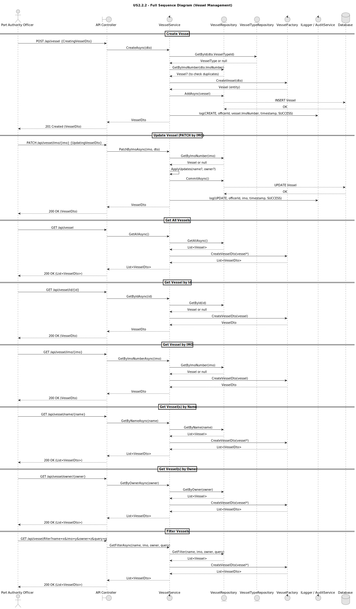
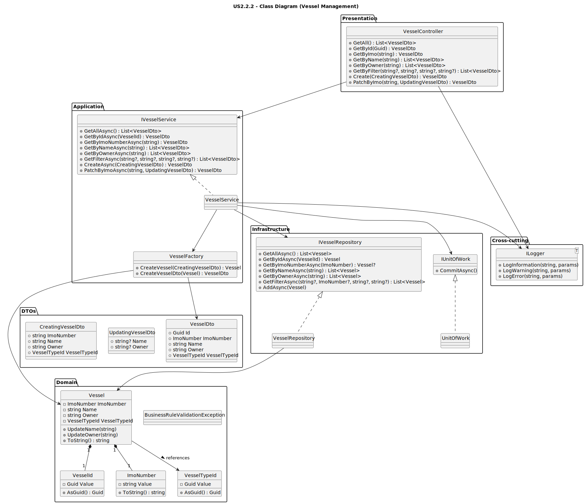

# **US2.2.2 – Manage Vessels (Create, Search, Update)**

---

## **3. Design – User Story Realization**

---

### **3.1. Rationale**

| **Interaction ID**                                              | **Question: Which class is responsible for...**      | **Answer**                 | **Justification (with patterns)**                                                                                     |
| :-------------------------------------------------------------- | :--------------------------------------------------- | :------------------------- | :-------------------------------------------------------------------------------------------------------------------- |
| **Step 1:** Officer submits request (e.g. `CreateVessel`)       | …interacting with the actor?                         | `VesselController`         | **Controller Pattern:** Centralizes API/HTTP request handling, decoupling user interface from application logic.      |
|                                                                 | …coordinating the user story execution?              | `VesselService`            | **Application Service:** Orchestrates business logic, applies validation, and delegates persistence to repositories.  |
| **Step 2:** Request data (`imoNumber`, `name`, `owner`, `type`) | …validating business rules and ensuring consistency? | `Vessel` (Aggregate Root)  | **Information Expert:** The aggregate enforces its own invariants — valid IMO, unique identifier, non-empty fields.   |
| **Step 3:** Persist vessel data                                 | …storing and retrieving aggregate instances?         | `VesselRepository`         | **Repository Pattern:** Abstracts database access, offering persistence operations while preserving domain integrity. |
| **Step 4:** Record audit information                            | …handling logging and monitoring of events?          | `ILogger` / `AuditService` | **Pure Fabrication:** Encapsulates cross-cutting concerns (audit logs, traceability) independently of domain logic.   |
| **Step 5:** Convert between DTOs and Entities                   | …creating domain objects and DTOs consistently?      | `VesselFactory`            | **Factory Pattern:** Centralizes and standardizes creation logic, mapping between input DTOs and domain entities.     |

---

### **Systematization**

Based on the above rationale, the following conceptual classes are promoted to software classes:

**Domain Layer:**

* `Vessel` (Aggregate Root)
* `VesselType` (Referenced Aggregate)
* `ImoNumber` (Value Object)

**Application and Infrastructure Layers:**

* `VesselController`
* `VesselService`
* `VesselRepository`
* `VesselFactory`
* `IUnitOfWork`
* `ILogger` / `AuditService` (Cross-cutting concern)

---

## **3.2. Sequence Diagram (SD)**

**Main steps represented:**

1. The `VesselController` receives the `POST /api/vessel` request with `CreatingVesselDto`.
2. Delegates to `VesselService`, which validates:

    * The **uniqueness** of the IMO number.
    * The **existence** of the referenced `VesselType`.
3. The `VesselService` uses the `VesselFactory` to instantiate the aggregate.
4. The `VesselRepository` persists the new vessel.
5. The `IUnitOfWork` ensures the transaction is committed atomically.
6. Finally, the system returns a `VesselDto` confirming successful creation.

---

## **3.3. Class Diagram (CD)**

The following class diagram depicts the relationships between the main domain and application classes for vessel management.

**Highlights:**

* `Vessel` acts as the **Aggregate Root**, maintaining integrity of associated value objects (`ImoNumber`, `VesselTypeId`).
* `VesselService` depends on:

    * `IVesselRepository` for persistence.
    * `VesselFactory` for object construction and mapping.
    * `IUnitOfWork` for transactional integrity.
* `VesselController` represents the API boundary and interacts solely with the `IVesselService` interface.
* DTOs (`CreatingVesselDto`, `UpdatingVesselDto`, `VesselDto`) ensure separation between domain and external representations.

