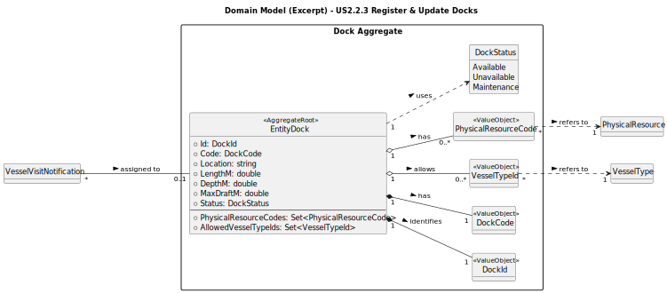

# US2.2.3 – Register and update docks

## 2. Analysis

### 2.1. Relevant Domain Model Excerpt

---

### 2.2. Other Remarks

* Dock as Master Data: Dock is core reference data used by multiple use cases, particularly during Vessel Visit planning and assignment.
* Multiple Vessel Types: A Dock may support multiple vessel types; any update that removes support for a VesselType may affect existing assignments and must be handled carefully.
* Referential integrity: While this US does not handle Vessel Visits, any future update logic should prevent invalidating scheduled visits that reference a Dock.
* Search and Filtering: Searching and filtering of docks is handled at the Application Service and Repository levels. Supported filters include dockCode, location, vesselType, status, and (optionally) physicalResourceCode.
* No Deletion in Scope: Deletion or deactivation of docks is out of scope for this sprint. Future iterations may adopt a status-based approach (Available / Unavailable / Maintenance) instead of hard deletion.
* Audit Logging: Create and update operations are logged as part of cross-cutting infrastructure. Dedicated audit fields (createdBy, createdAt) may be added in future versions for full traceability.
* Field Semantics and Constraints:
DockCode is unique and immutable identifier of the dock.
Location is free-form descriptive text (not GPS coordinates).
Length, Depth, and MaxDraft are numeric fields in meters and must be strictly > 0.
PhysicalResourceCodes must correspond to valid physical resources and cannot be duplicated across docks.
AllowedVesselTypes must reference existing registered VesselTypes.
* Indexing & Performance (Non-functional):
  Recommended database indexes include:
DockCode (unique)
Location (text search)
VesselTypeId association (for filtering)

