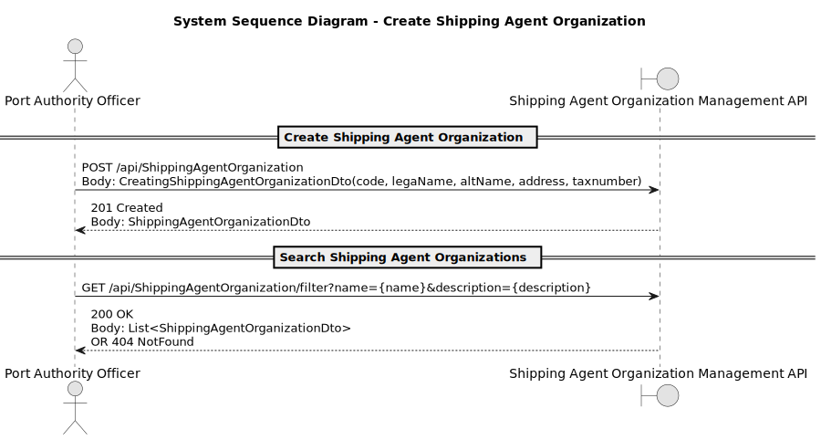

# US2.2.5 - Create and manage vessel types

## 1. Requirements Engineering

### 1.1. User Story Description

> **As a Port Authority Officer**, I **want to register new shipping agent organizations**, so that they can operate within the port’s digital system.

**Preconditions**

**Postconditions**
* Shipping agent organizations are available for reference when registering new hipping agent representatives.
* Changes are auditable (who/when/what).

---

### 1.2. Customer Specifications and Clarifications

> Each organization must have at least an **identifier**, **legal** and **alternative names**, an **address**, its **tax number**.
> **Identifiers** must be alphanumeric codes with a max length of 10 characters
> **Tax numbers** must follow the format of all EU countries.
> Organizations must have **one legal name** and **one alternative name**. 
> Each Organization must have only **one representative**.

**From forum**

> **Q:** Should the identifier be provided by the user when creating a new Organization or should it be generated? What pattern should it follow?
> 
> **A:**  Identifier is provided by the user. Alphanumeric code (max. length 10).

> **Q:** How many legal or alternative names are there? (1 legal name and multiple alternatives names?)
> 
> **A:** One legal name and one alternative is enough.

> **Q:** Must the tax number follow any specific pattern?
> 
> **A:**  The system must support Tax Numbers of every European Country.

---

### 1.3. Acceptance Criteria

* **AC01 – Create:**Each organization must have at least an identifier, legal and alternative names, an address, its
tax number.
* **AC02 – Create:** Each organization must include at least one representative at the time of registration.
* **AC03 – Validation (code):** `ShippingAgentCode`; error shown if invalid.
* **AC04 – Validation (consttax numberraints):** `TaxNumber`; error shown if invalid.
* **AC05 – Uniqueness:** `code` must be **unique**.
* **AC06 – Error Handling:** On validation failure, the user gets **clear, actionable messages**; no partial records.

---

### 1.4. Found out Dependencies

* **Depends on:** Authentication/Authorization (role: Port Authority Officer).
* **Provides to:** US2.2.6 (Shipping Agent Representative registration), which **references ShippingAgentOrganization**.
* **Cross-cutting:** Audit/Logging, Search API.

---

### 1.5. Input and Output Data

**Input Data (Create/Update form or API):**

* `code : string` *(required, unique)*
* `lega name : string` *(required)*
* `alternativstring` *(required, unique)*
* `tax number : string` *(required, unique)*

**Output Data:**

* On success: Business Domain: SAO Created Successfully with Code Number [{CODE}] and System ID [{ID}]..
* On failure: **error list** with field-level messages (e.g., “ShippingOrganizationCode can't be empty. Must be at most 10  alphanumeric characters.”, “Name already exists”).
* For search: **paged list** of `{id,code, legal name, alt name, address, taxnumber}` with filter metadata.

---

### 1.6. System Sequence Diagram (SSD)

