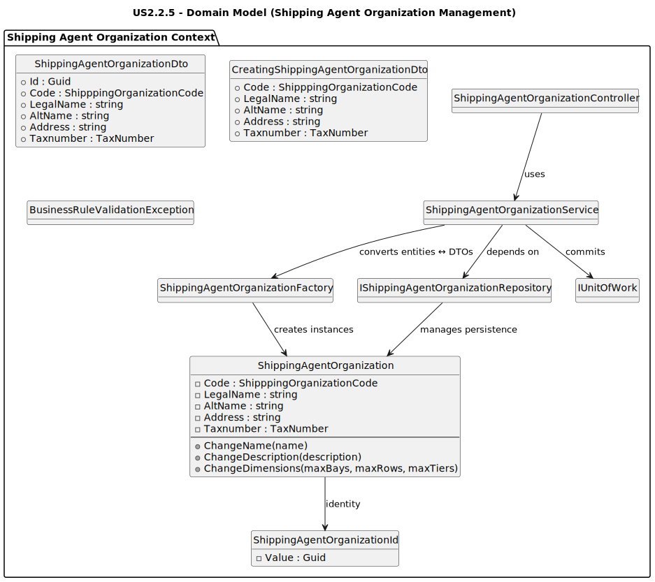
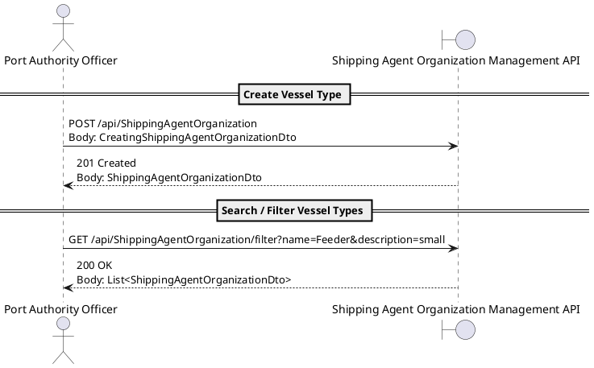

# **US2.2.1 – Create and Manage Vessel Types**

## 2. Analysis

---

### **2.1. Relevant Domain Model Excerpt**

**Explanation:**

* The **ShippingAgentOrganization** aggregate represents a standardized definition of shipping agent organization configurations.
* Each `ShippingAgentOrganization` has a **unique code**, legal name, alternative name, address, and tax number.
* The **ShippingAgentOrganizationService** handles business logic for creation, update, and filtering, enforcing domain rules through the **ShippingAgentOrganizationRepository** and **BusinessRuleValidationException**.
* The **ShippingAgentOrganizationFactory** provides conversions between domain entities and data transfer objects (**DTOs**) used by the REST API layer.

---

### **2.2. Domain Concepts and Responsibilities**

| **Concept**                         | **Responsibility**                                                                                                |
| ----------------------------------- | ----------------------------------------------------------------------------------------------------------------- |
| **ShippingAgentOrganization**                      | Entity representing a shipping agent organization.
| **ShippingAgentOrganizationCode**                    | Value Object encapsulating the unique code for a `ShippingAgentOrganization`.                                       |
| **ShippingAgentOrganizationFactory**               | Creates and maps between `ShippingAgentOrganization` entities and DTOs.                                                          |
| **IShippingAgentOrganizationRepository**           | Interface for retrieving, filtering, and persisting `ShippingAgentOrganization` aggregates.                                      |
| **ShippingAgentOrganizationService**               | Application Service responsible for orchestration of business logic (validation, filtering, persistence).         |
| **ShippingAgentOrganizationController**            | API layer exposing REST endpoints to manage vessel types (`GET`, `POST`, `PUT`).                        |
| **BusinessRuleValidationException** | Exception representing domain rule violations (e.g., invalid capacity, duplicate name).                           |

---

### **2.3. Invariants and Business Rules**

| **Rule ID** | **Description**                                                                                                     |
| ----------- | ------------------------------------------------------------------------------------------------------------------- |
| **R1**      | `Code` must be an **unique alphanumerical** string of legnth up to **10**                                     |
| **R2**      | `Tax Number` length must respect the different type of tax numbers for all **EU** countries.                                                |                                        |
| **R3**      | Search/filter must return all ShippingAgentOrganizations that partially match the input filters (`LIKE` semantics).                |

---

### **2.4. Input and Output Data**

**Input Data (from API / form submission):**

* `code : string` *(required, unique)*
* `lega name : string` *(required)*
* `alternativstring` *(required, unique)*
* `tax number : string` *(required, unique)*

**Output Data:**

* **On success (Create/Update):**
  Returns a `ShippingAgentOrganizationDto` containing all shipping agent organization attributes and computed capacity.
* **On error:**
  Returns structured messages like:
  `"Name already exists."`, `"Code  must be alphanumeric codes with a max length of 10 characters"`

---

### **2.5. Behavioral Rules (Scenarios)**

| **Scenario**                     | **Preconditions**                   | **Action**                              | **Expected Result**                            |
| -------------------------------- | ----------------------------------- | --------------------------------------- | ---------------------------------------------- |
| **Create new ShippingAgentOrganization**        | No existing type with the same code | Officer submits creation form           | ShippingAgentOrganization created and persisted               |
| **Duplicate name on create**     | A type with same code exists        | Officer submits creation                | System rejects and shows code already exists” |
| **Invalid values**               | Negative or zero dimensions         | Officer submits form                    | System rejects with validation message         |
| **Search by code**        | Types exist in DB                   | Officer searches specific code               | Matching ShippingAgentOrganization returned              |
| **Search by legal name**        | Types exist in DB                   | Officer searches specific code               | Matching ShippingAgentOrganization returned              |
| **Search by tax number**        | Types exist in DB                   | Officer searches specific code               | Matching ShippingAgentOrganization returned              |
| **No results in filter**         | DB contains none                    | Officer filters “invalid name”          | System returns “No Shipping Agent Organization Found”         |

---

### **2.6. System Sequence Diagram (SSD)**

#### **Alternative 1 – Create / Update / Search**

---

### **2.7. Other Remarks**

* **Auditability:** All create/update operations are logged with timestamp, officer ID, and success/failure status.
* **Search optimization:** The repository will use indexed text search for `Code`, `Legal Name` and `TaxNumber` fields.
* **Deletion:** Not implemented in this iteration; may be introduced as soft-delete in future sprints.
* **Updating:** Not implemented in this iteration; may be introduced in future sprints.
* **Error Handling:** Standardized using `BusinessRuleValidationException` and logged by the application service.
