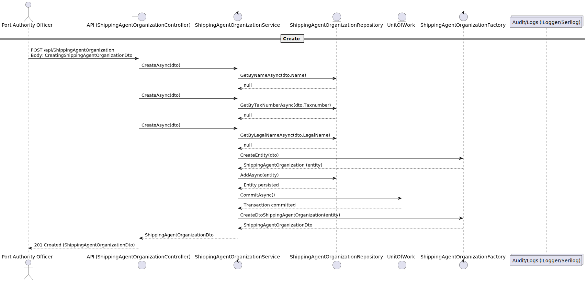
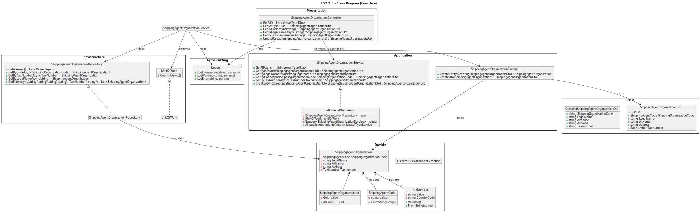

# US2.2.5 – Create Shipping Agent Organizations

## 3. Design – User Story Realization

### 3.1. Rationale

This section defines which software class takes responsibility for each interaction step, following the **System Sequence Diagram** established in the analysis phase.

| Interaction ID                                              | Question: Which class is responsible for... | Answer                                   | Justification (with patterns)                                                                                                 |
| ----------------------------------------------------------- | ------------------------------------------- | ---------------------------------------- | ----------------------------------------------------------------------------------------------------------------------------- |
| Step 1: Officer submits “Create/Update ShippingAgentOrganization          | …interacting with the actor?                | `ShippingAgentOrganizationController`                   | **Controller Pattern:** centralizes request handling from the external API and delegates logic to the application layer.       |
|                                                             | …coordinating the use case?                 | `IShippingAgentOrganizationeService` / `ShippingAgentOrganizationService` | **Application Service:** orchestrates business logic, enforcing workflow and delegating persistence to repositories.          |
| Step 2: request data (name, description, constraints, etc.) | …validating business rules?                 | `ShippingAgentOrganization` (Aggregate Root)            | **Information Expert:** the aggregate root enforces invariants (positive constraints, name uniqueness, etc.).                |
|                                                             | …transforming between DTOs and Entities?    | `ShippingAgentOrganizationFactory`                      | **Factory Pattern:** centralizes creation of domain objects and DTOs to ensure consistent transformations.                    |
| Step 3: persist ShippingAgentOrganization                                  | …storing/retrieving VesselType data?        | `ShippingAgentOrganizationRepository` + `UnitOfWork`    | **Repository Pattern:** abstracts persistence; **Unit of Work:** ensures transactional consistency and atomic commits.        |
| Step 4: log action                                          | …recording audit trail or logs?             | `ILogger` (e.g., Serilog)                | **Pure Fabrication:** cross-cutting concern responsible for recording audit, monitoring, and debugging information.           |

**Systematization**

According to the above rationale, the conceptual classes promoted to software classes are:

- `ShippingAgentOrganization`

Other software classes (i.e., Pure Fabrication) identified:

- `ShippingAgentOrganizationController`
- `ShippingAgentOrganizationService` / `ShippingAgentOrganizationService`
- `ShippingAgentOrganizationFactory`
- `ShippingAgentOrganizationRepository`
- `TaxNumber`
- `ShippingAgentCode`
- `UnitOfWork`
- `ILogger` (Logging / Audit)

---

### 3.2. Sequence Diagram (SD)

**Full Diagram:**

---

### 3.3. Class Diagram (CD)

The class diagram represents the structural organization of the main components involved in the user story.  
It includes the **Domain Aggregate**, **Application Service**, **Repository**, **Factory**, and **Controller**, following the **DDD Layered Architecture**.

**Main elements:**
- `ShippingAgentOrganization` — Aggregate Root defining attributes and business rules.
- `CreatingShippingAgentOrganizationDto` / `UpdatingShippingAgentOrganizationDto` — DTOs used for data transfer between layers.
- `IShippingAgentOrganizationService` / `ShippingAgentOrganizationService` — Application Service interface and implementation coordinating the use case.
- `ShippingAgentOrganizationRepository` and `IUnitOfWork` — Infrastructure components for persistence and transaction management.
- `ShippingAgentOrganizationController` — REST controller handling API requests and responses.
- `ILogger` — Cross-cutting service for audit logging.

**Diagram:**

