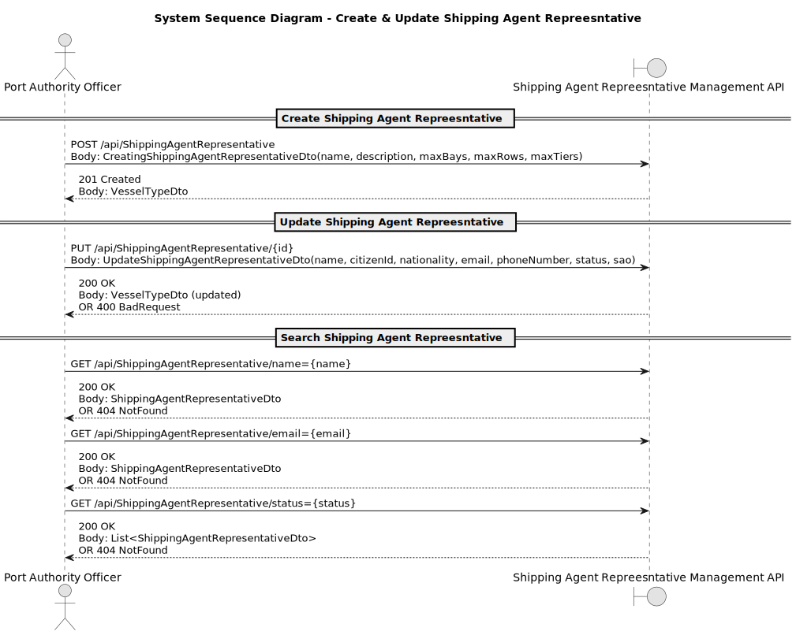

# US2.2.6 - Create and manage representatives of a shipping agent organization

## 1. Requirements Engineering

### 1.1. User Story Description

> **As a Port Authority Officer**, I want to **register and manage representatives of a shipping agent organization (create, update, deactivate)**, so that the right individuals are authorized to interact with the system on behalf of their organization.

**Preconditions**

* Officer is authenticated and authorized.
* The “Shipping Organization” module is available.

**Postconditions**

* A new **ShippingAgentRepreesntative** is persisted or an existing one is updated.
* Changes are auditable (who/when/what).

---

### 1.2. Customer Specifications and Clarifications

**From forum**

> **Q:** Does the Shipping Agent Representative's Citizen ID have to follow any specific format?
> 
> **A:** Yes.

> **Q:** Which attributes of a representative can be updated after registration?

> **A:** Most often, it is the contact information (email and phone). Other data like name and citizen ID can be updated too, but mainly due to user input mistakes. However, deactivation (and activation) may occur regularly.

> **Q:** According to the Shipping Representative information, is there any specific concept that could identify it in the business, for example, the email?

> **A:** Shipping Agent Representatives may have several unique identifiers:
        - Citizen ID, more generally used;
        - Email, mainly used for authentication purposes.

---

### 1.3. Acceptance Criteria
* **AC01 – Create:** Each representative must be associated with **exactly one** shipping agent organization.
* **AC02 – Create:** Required details to create a representative include **name, citizen ID, nationality, email, and phone number**.
* **AC02 – Update:** System allows updating the fields of an existing ShippingAgentRepresentative.
* **AC02 – Update:** System allows deactivation of an existing ShippingAgentRepresentative.
* **AC04 – Audit:** Create/Update actions are **logged** with timestamp, officer ID, and action outcome.
* **AC05 – Error Handling:** On validation failure, the user gets **clear, actionable messages**; no partial records.

---

### 1.4. Found out Dependencies

* **Depends on:** Authentication/Authorization (role: Port Authority Officer) and US 2.2.5 (Shipping Agent Orgnization).
* **Provides to:** USs 2.2.8, 2.2.9 and 2.2.10 (Vessel Visit Notification), which **references ShippingAgentRepresentative**.
* **Cross-cutting:** Audit/Logging, Search API.

---

### 1.5. Input and Output Data

**Input Data (Create/Update form or API):**

* `Name : string`
* `Citizen Id : CitizenId`
* `Nationality : Nationality`
* `Email : EmailAddress `
* `PhoneNumber : Phonenumber`
* `Status : Status`
* `Shipping Agent Organization : ShippingAgentOrganization `

**Output Data:**

* On success: persisted **ShippingAgentRepresentative DTO** (id, all fields, created/updated timestamps).
* On failure: **error list** with field-level messages (e.g., “Capacity must be > 0”, “Name already exists”).
---

### 1.6. System Sequence Diagram (SSD)

