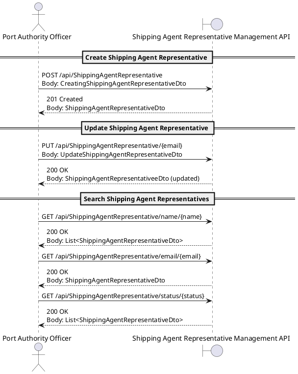

# **US2.2.1 – Create and Manage Shipping Agent Representatives**

## 2. Analysis

---

### **2.1. Relevant Domain Model Excerpt**

**Explanation:**

* The **ShippingAgentRepresentative** aggregate represents a standardized definition of vessel configurations.
* Each `ShippingAgentRepresentatives` has a **unique citizen ID and Shipping Agent Organization**, name, e-mail, nationality, phone number and status
* The **ShippingAgentRepresentativeService** handles business logic for creation, update, and filtering, enforcing domain rules through the **ShippingAgentRepresentativeRepository** and **BusinessRuleValidationException**.
* The **ShippingAgentRepresentativeFactory** provides conversions between domain entities and data transfer objects (**DTOs**) used by the REST API layer.

---

### **2.2. Domain Concepts and Responsibilities**

| **Concept**                         | **Responsibility**                                                                                                |
| ----------------------------------- | ----------------------------------------------------------------------------------------------------------------- |
| **ShippingAgentRepresentative**                      | Aggregate Root representing a Shipping Agent Organization's representaive including name, e-mail, nationality, phone number and status. |
| **ShippingAgentRepresentativeId**                    | Value Object encapsulating the unique identifier (UUID) for a `ShippingAgentRepresentative`.                                       |
| **ShippingAgentRepresentativeFactory**               | Creates and maps between `ShippingAgentRepresentative` entities and DTOs.                                                          |
| **IShippingAgentRepresentativeRepository**           | Interface for retrieving, filtering, and persisting `ShippingAgentRepresentative` aggregates.                                      |
| **ShippingAgentRepresentativeService**               | Application Service responsible for orchestration of business logic (validation, filtering, persistence).         |
| **ShippingAgentRepresentativeController**            | API layer exposing REST endpoints to manage vessel types (`GET`, `POST`, `PUT`, `FILTER`).                        |
| **BusinessRuleValidationException** | Exception representing domain rule violations (e.g., invalid capacity, duplicate name).                           |

---

### **2.3. Invariants and Business Rules**

| **Rule ID** | **Description**                                                                                                     |
| ----------- | ------------------------------------------------------------------------------------------------------------------- |
| **R1**      | Only ***one** `ShippingAgentOrganization` may be assigned to one ShippingAgentRepresentative.                                     |
| **R2**      | `CitizenID` must allow for identification of all european countries.                                           |

---

### **2.4. Input and Output Data**

**Input Data (from API / form submission):**

* `Name : string`  – required
* `Citizen Id : CitizenId`  – required, unique
* `Nationality : Nationality`  – required
* `Email : EmailAddress `  – required
* `PhoneNumber : Phonenumber`  – required
* `Status : Status`  – required
* `Shipping Agent Organization : ShippingAgentOrganization `  – required, unique

**Output Data:**

* **On success (Create/Update):**
  Returns a `ShippingAgentRepresentativeDto` containing all vessel type attributes and computed capacity.
* **On error:**
  Returns structured messages like:
  `"An SAR with citizen Id [CitizenId] already exists on DB"`

---

### **2.5. Behavioral Rules (Scenarios)**

| **Scenario**                     | **Preconditions**                   | **Action**                              | **Expected Result**                            |
| -------------------------------- | ----------------------------------- | --------------------------------------- | ---------------------------------------------- |
| **Create new ShippingAgentRepresentative**        | No existing type with the same name | Officer submits creation form           | VesselType created and persisted               |
| **Duplicate CitizenId on create**     | A type with same name exists        | Officer submits creation                | System rejects and shows error message. |
| **Update ShippingAgentRepresentative status** | Representative exists and valid               | Officer modifies `Status` | `Status` changed and ShippingAgentRepresentative saved.        |
| **Invalid values**               | Negative or zero dimensions         | Officer submits form                    | System rejects with validation message         |
| **Search by name**        | ShippingAgentRepresentative exist in DB                   | Officer searches “Alexandre Silva”               | All matching ShippingAgentRepresentative returned              |
| **No results in filter**         | DB contains none                    | Officer filters “invalid name”          | System returns “No Vessel Types Found”         |

---

### **2.6. System Sequence Diagram (SSD)**

#### **Alternative 1 – Create / Update / Search**

---

### **2.7. Other Remarks**

* **Auditability:** All create/update operations are logged with timestamp, officer ID, and success/failure status.
* **Search optimization:** The repository will use indexed text search for `Name` and `Description` fields.
* **Deletion:** Not implemented in this iteration; may be introduced as soft-delete in future sprints.
* **Error Handling:** Standardized using `BusinessRuleValidationException` and logged by the application service.
