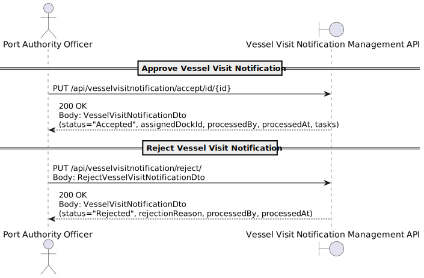

# US2.2.7 – Review Pending Vessel Visit Notifications

## 1. Requirements Engineering

### 1.1. User Story Description

**As a Port Authority Officer, I want to review pending Vessel Visit Notifications and approve or reject them, so that docking schedules remain under port control.**

---

### 1.2. Customer Specifications and Clarifications

**From the specifications document and client meetings:**

* When approving notifications:
    * Officer must **assign a temporarily dock** where the vessel should berth
    * Assignment potentially supported by **intelligent algorithm** considering pending visits, vessel type, dock capacity, and operational constraints

* When rejecting notifications:
    * Officer must **provide a reason for rejection** (e.g., information is missing, dock unavailability)
    * **Shipping agent representative** can then review and update the notification for new decision

* All decisions must be **logged with timestamp, officer ID, and decision outcome** for auditing purposes

* Notifications can have different statuses: **in progress**, **submitted** (pending approval), **approved** (with dock assignment), or **rejected** (with reason)

* The system must support **dock assignment optimization** considering vessel characteristics and port operational constraints

**From forum:**

> **Question:** Hello!
Knowing that a Vessel Visit Notification (VVN) can be modified after being rejected (and this may happen multiple times for the same VVN), is it necessary for the system to store the information of the VVN for each update stage it goes through?
I am not referring to the log with timestamp, officer ID, and decision outcome for auditing purposes, but rather to the VVN’s actual information, so that in the case of historical review, one can know the VVN’s details at each of its stages.
Thank you

> **Answer:** It would be a nice feature.
I'll only consider it later, as a system improvement.

---

> **Question:** Good afternoon,
The System Specifications document delineates that "Focusing on port operations, the system manages vessels, their scheduled visits, associated cargo, and the execution of loading and unloading tasks."
Should we assume that all tasks should be associated with a dock and storage area, or should we take into account tasks can that take place only at the dock or only at the storage area?

> **Answer:** Tasks result from the need to unload and load containers from/to a vessel, according to the information on the cargo manifest(s) of approved Vessel Visit Notifications.
Side note: This part of the problem is not being addressed during Sprint A.

---

### 1.3. Acceptance Criteria

* **AC01:** Officer must be able to view all pending Vessel Visit Notifications awaiting approval
* **AC02:** When approving a notification, officer must assign a dock to the vessel
* **AC03:** When rejecting a notification, officer must provide a clear reason for rejection
* **AC04:** All approval/rejection decisions must be logged with timestamp, officer ID, and decision outcome
* **AC05:** Rejected notifications can be updated by shipping agent representatives for re-submission
* **AC06:** Officer must be able to access approval/rejection functionality via appropriate REST endpoints
* **AC07:** System must validate dock assignment constraints (vessel type compatibility, dock availability)
* **AC08:** Approved notifications must update vessel visit status and dock assignment information
* **AC09:** System must prevent approval of notifications with incomplete or invalid information

---

### 1.4. Found Dependencies

* **Vessel Visit Notification module** – notifications must exist and be in "submitted" status
* **Dock Management module** – to validate dock assignments and availability
* **Vessel and Vessel Type modules** – to validate vessel compatibility with assigned docks
* **Audit Logging system** – to record all approval/rejection decisions
* **Authentication/Authorization system** – to verify officer permissions
* **Shipping Agent module** – to enable representatives to update rejected notifications

---

### 1.5. Input and Output Data

**Input Data:**

* **ApproveVesselVisitDto**
    * VesselVisitNotificationId
    * AssignedDockId
    * ApprovalComments (optional)

* **RejectVesselVisitDto**
    * VesselVisitNotificationId
    * RejectionReason
    * RejectionComments (optional)

**Output Data:**

* **VesselVisitNotificationDto**
    * Id
    * VesselInfo (IMO, name, type)
    * ExpectedArrival/Departure
    * Status (approved/rejected)
    * AssignedDockId (if approved)
    * RejectionReason (if rejected)
    * ProcessedBy (officer ID)
    * ProcessedAt (timestamp)

* **Response Messages**
    * Success (200 OK)
    * Validation errors (400 Bad Request)
    * Unauthorized (401)
    * Not found (404)
    * Conflict when business rules are violated (409)

---

### 1.6. System Sequence Diagram (SSD)

---

### 1.7. Other Relevant Remarks

* Business rules (dock compatibility, availability validation) must be enforced at the **domain layer**
* Audit trail must capture:
    * Officer identity and timestamp
    * Decision type (approval/rejection)
    * VesselVisitNotificationId and vessel details
    * Assigned dock (if approved) or rejection reason
    * Any additional comments
* **Dock assignment algorithm** should consider:
    * Vessel type and dock compatibility
    * Expected cargo volume and dock crane capacity
    * Overlapping vessel schedules
    * Dock physical constraints (length, depth, max draft)
* Integration with **notification system** to inform shipping agents of decisions
* This US is critical for **port operational control** and directly impacts subsequent scheduling and resource allocation processes
