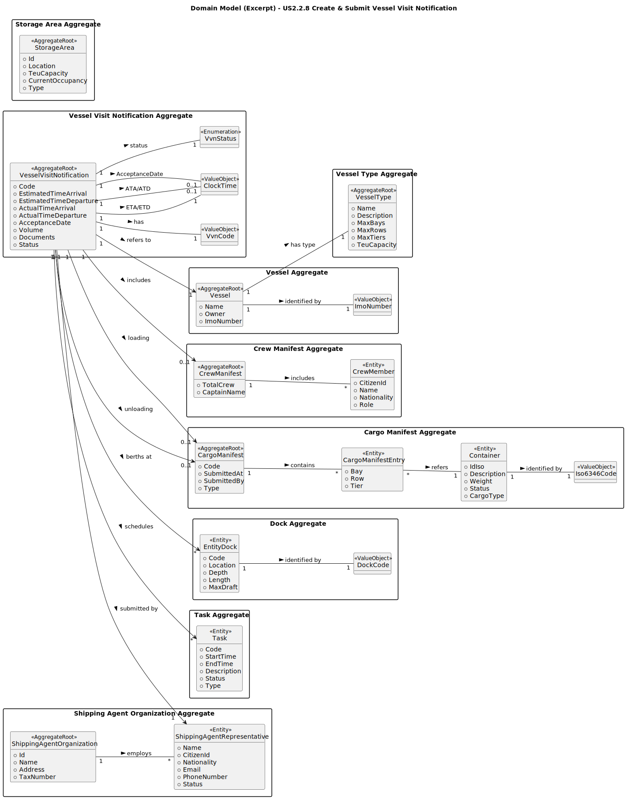

# US2.2.8 – Create and Submit Vessel Visit Notification

## 2. Analysis

### 2.1. Relevant Domain Model Excerpt

### **Description of the Domain Model Excerpt**

The **Vessel Visit Notification (VVN)** aggregate root represents the central concept through which a **Shipping Agent Representative** formally notifies the **Port Authority** about a vessel’s intended visit to the port.
This notification includes vessel information, berthing docks, cargo manifests, and crew data, ensuring that all operations can be **scheduled, authorized, and tracked** efficiently.

---

#### **Main Entities and Value Objects**

* **VesselVisitNotification (Aggregate Root)**
  Represents the notification of an incoming vessel, containing operational data such as ETA/ETD, volume, documents, and acceptance date.
  It enforces the business lifecycle through domain methods like `Submit()`, `Withdraw()`, `Resume()`, `MarkPending()`, and `Accept()`.

* **VvnCode (Value Object)**
  Unique immutable identifier for each VVN, following the business rule format `{YEAR}-{PORT_CODE}-{SEQUENTIAL_NUMBER}` (e.g., `2025-PTLEI-000012`).

* **ClockTime (Value Object)**
  Represents validated and standardized time values such as Estimated/Actual Time of Arrival and Departure.
  Ensures consistency and logical correctness of temporal information.

* **VvnStatus (Enumeration)**
  Defines the possible lifecycle states of a VVN:
  `InProgress`, `Submitted`, `PendingInformation`, `Withdrawn`, and `Accepted`.

* **Vessel (Aggregate Root)**
  Represents the physical ship related to the visit.
  Identified by an **ImoNumber (Value Object)** and linked to a **VesselType**, defining technical constraints (e.g., bays, rows, tiers, TEU capacity).

* **CrewManifest (Aggregate Root)**
  Contains crew-related information such as total crew and captain’s name.
  Linked to multiple **CrewMember** entities with their name, nationality, and role.

* **CargoManifest (Aggregate Root)**
  Holds detailed cargo information for both loading and unloading operations.
  Each **CargoManifest** is composed of multiple **CargoManifestEntry** elements, each referencing **Container** entities identified by an **Iso6346Code**, validated under ISO 6346:2022.

* **EntityDock (Entity)**
  Represents a docking position within the port.
  Each dock is defined by a **DockCode**, location, depth, and length, and can be linked to multiple VVNs for berth scheduling.

* **Task (Entity)**
  Represents planned operations (loading, unloading, inspection, maintenance) related to a VVN.
  Contains scheduling information (start and end time), type, and current status.

* **StorageArea (Aggregate Root)**
  Represents the physical storage zone where containers are temporarily placed before or after ship operations.

* **ShippingAgentRepresentative / ShippingAgentOrganization (Entities)**
  Represent the organization and its individual representatives responsible for submitting the VVN.
  Each representative belongs to one organization and can create multiple VVNs.

---

#### **Relationships**

* `VesselVisitNotification` **1 → 1** `Vessel` (identified by `ImoNumber`)
* `VesselVisitNotification` **1 → 0..1** `CrewManifest`
* `VesselVisitNotification` **1 → 0..1** `CargoManifest (Loading)`
* `VesselVisitNotification` **1 → 0..1** `CargoManifest (Unloading)`
* `VesselVisitNotification` **1 → *`EntityDock`** (berthing locations)
* `VesselVisitNotification` **1 → *`Task`** (operational activities)
* `CargoManifest` **1 → *`Container`**, each identified by an **Iso6346Code**
* `CrewManifest` **1 → *`CrewMember`**
* `Vessel` **1 → 1** `VesselType` (structural definition)
* `ShippingAgentRepresentative` **1 → 1** `ShippingAgentOrganization`
* `VesselVisitNotification` **1 → 1** `ShippingAgentRepresentative` (submitted by)

---

#### **Additional Remarks**

* The **VVN Aggregate** ensures strong consistency through domain rules — transitions between states are strictly controlled.
* All **time fields** use `ClockTime` to ensure temporal data validation.
* The **volume** must always be non-negative.
* The **acceptance date** is automatically registered once the VVN is accepted by the Port Authority.
* **CrewManifest** and **CargoManifest** aggregates are validated separately before being linked.
* Once a VVN reaches the **Accepted** state, it becomes immutable and archived for traceability.
* **PendingInformation** indicates that the Port Authority has requested updates after submission — not a regression to InProgress.

---

### 2.2. Other Remarks

* The **VVN aggregate root** controls all lifecycle transitions through explicit domain methods that validate each state change.
* **Invariants** such as non-negative volume, immutable VvnCode, and valid time objects are enforced at the domain level.
* The **Port Authority Officer** can only act on VVNs in `Submitted` or `PendingInformation` states (e.g., mark as pending or accept).
* A **withdrawn VVN** is not deleted — it remains in the system to allow resumption.
* The **AcceptanceDate** is automatically recorded when the VVN is accepted by the Port Authority.
* The **CargoManifest** and **CrewManifest** aggregates are validated separately before being linked to a VVN.
* The **ClockTime** value object guarantees consistent datetime formatting and validation across all VVN operations.
* Once **Accepted**, the VVN becomes immutable and is archived for traceability.

