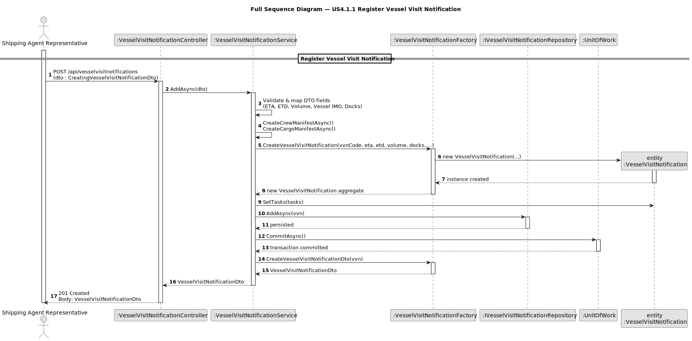
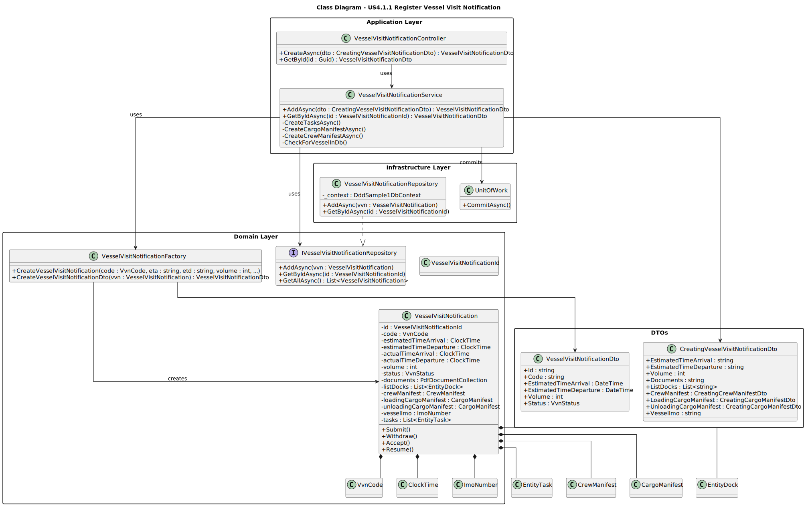

# US2.2.8 - Register Vessel Visit Notification

## 3. Design - User Story Realization

### 3.1. Rationale

_**Note that SSD - Alternative One is adopted.**_

| Interaction ID                      | Question: Which class is responsible for...           | Answer | Justification (with patterns)                                                                                 |
|:------------------------------------|:------------------------------------------------------|:-------|:--------------------------------------------------------------------------------------------------------------|
| Step 1 : Actor initiates registration of VVN  | ... interacting with the actor?                      | `VesselVisitNotificationController` | Pure Fabrication: there is no reason to assign this responsibility to a domain class; the controller handles interaction with the external API request. |
|                                      | ... coordinating the US?                              | `VesselVisitNotificationService`   | Controller (Application Service) — responsible for orchestrating domain logic and repository access. |
| Step 2 : Validate and convert input data (DTO → domain) | ... performing input validation and object creation? | `VesselVisitNotificationFactory` | Pure Fabrication — encapsulates the creation of complex aggregates (VVN + related entities) following the Factory pattern. |
| Step 3 : Persist the new VVN aggregate | ... storing the new entity? | `VesselVisitNotificationRepository` | Repository Pattern — abstracts persistence and provides an interface for aggregate access. |
| Step 4 : Commit transaction | ... finalizing the persistence? | `UnitOfWork` | Ensures atomicity and consistency of the persistence operation. |
| Step 5 : Return created object to the actor | ... converting domain model to DTO for presentation? | `VesselVisitNotificationFactory` | Pure Fabrication — builds a DTO representation decoupled from the domain logic. |

### Systematization

According to the taken rationale, the conceptual classes promoted to software classes are:

* `VesselVisitNotification` (Aggregate Root)
* `VesselVisitNotificationService` (Application Service)
* `VesselVisitNotificationFactory` (Assembler / Builder)
* `VesselVisitNotificationRepository` (Repository Interface)
* `VesselVisitNotificationController` (REST Controller)

Other software classes (i.e. Pure Fabrication) identified:

* `VesselVisitNotificationFactory`
* DTOs (`CreatingVesselVisitNotificationDto`, `VesselVisitNotificationDto`)

---

## 3.2. Sequence Diagram (SD)

### Full Diagram

This diagram shows the complete flow of the “Register Vessel Visit Notification” process.

## 3.3. Class Diagram (CD)

