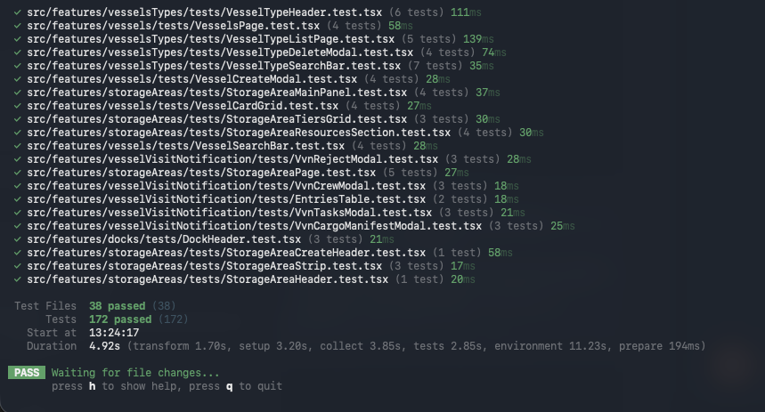
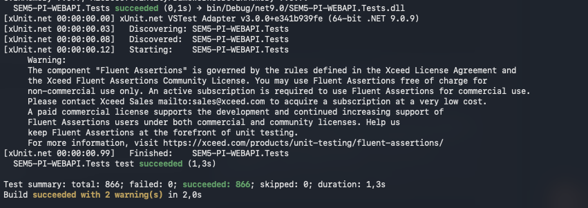
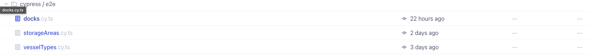
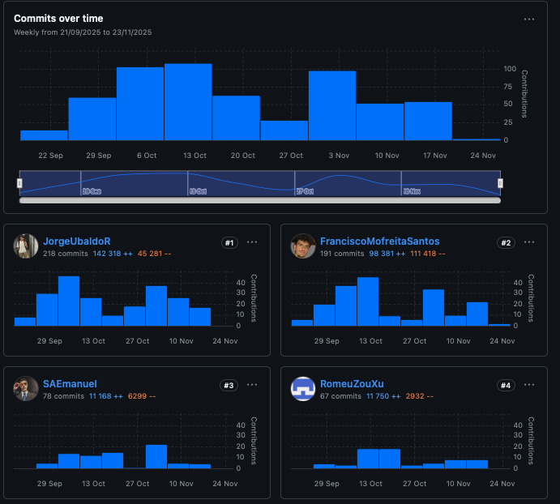
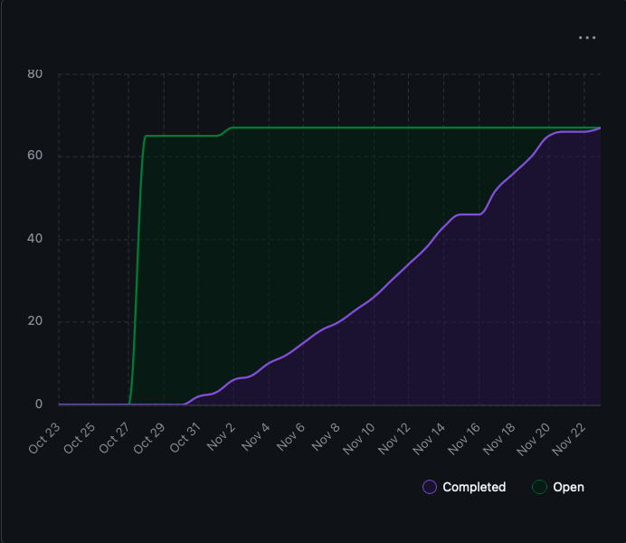
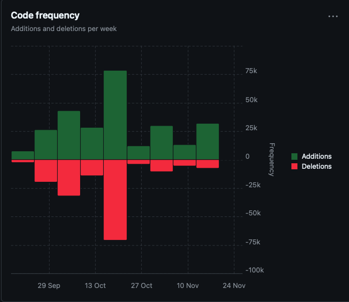
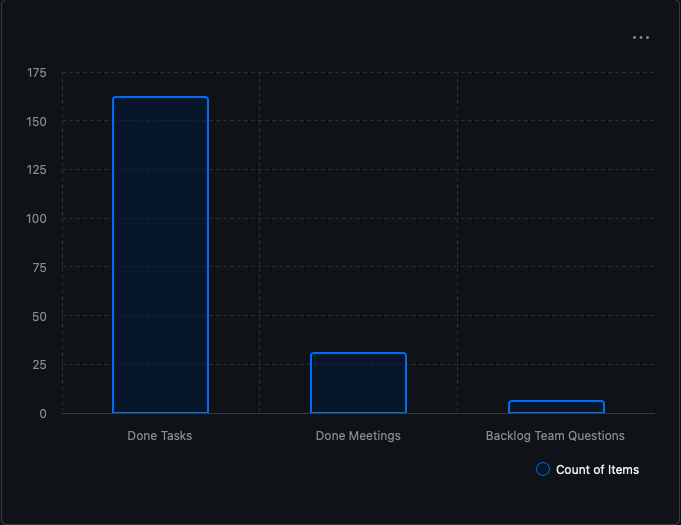

# **Sprint B — Review & Retrospective**

### *ThPA Port Management Platform*

### *Equipa 3DJ — LEI — ISEP (2025/2026)*

---

## **Introdução**

O presente documento descreve detalhadamente a **Sprint Review** e a **Sprint Retrospective** da *Sprint B* do projeto **ThPA Port Management Platform**, desenvolvida no âmbito do Projeto Integrado do 5.º semestre na Licenciatura de Engenharia Informática do ISEP.

A Sprint B representou a segunda fase de desenvolvimento do sistema, solidificando vários blocos estruturais do backend e frontend, reforçando a testabilidade das funcionalidades e consolidando integrações chave com o domínio e os serviços REST.

O foco desta entrega foi:

* Expansão e estabilização da arquitetura backend (.NET 8 + DDD + EF Core)
* Implementação completa das funcionalidades base de *Vessel Types*, *Vessels*, *Storage Areas*, *VVN*
* Desenvolvimento de UI/UX unificado para a SPA
* Implementação massiva de testes:

    * **Backend:** +860 testes unitários e de integração
    * **Frontend React:** Vitest + React Testing Library
    * **E2E:** Cypress
* Otimização de performance, acessibilidade, i18n, layout responsivo e theme-switching (light/dark)

---

# **1. Planeamento da Sprint**

A Sprint B foi planeada com base nos incrementos do Sprint A e no backlog priorizado.
O planeamento seguiu:

* **Refinamento semanal** do backlog
* Definição clara de DoD por user story
* Estimativas colaborativas com Planning Poker
* Planeamento de capacidade ajustado (férias, testes académicos, carga de trabalho)
* Validação de dependências técnicas (EF Core, React Router, DTO mappings, etc.)

### **Objetivos principais definidos no Sprint Planning**

| Área               | Objetivo                                                                 |
| ------------------ | ------------------------------------------------------------------------ |
| **Backend (API)**  | Concluir todos os agregados: VesselType, Vessel, StorageArea, VVN, Docks |
| **Frontend (SPA)** | Criar layout unificado, suporte a tema, i18n, navegação com roles        |
| **Testes**         | Criar pirâmide completa: unit → integration → e2e                        |
| **Arquitetura**    | Consolidar mobilização DDD + Application Services + DTO Mapping          |
| **DevOps**         | Estabilizar pipeline CI e aumentar cobertura de testes                   |

---

# **2. Desenvolvimento — Práticas de Engenharia**

A equipa aplicou rigorosamente práticas de engenharia moderna:

## ✔ Domain-Driven Design (DDD)

* Entidades ricas
* Value objects imutáveis
* Agregados com invariantes fortes
* Regras encapsuladas no domínio e não em controllers

## ✔ Arquitetura Clean

* `Domain` → `Application` → `Infrastructure` → `API`
* Repositórios e Unit of Work isolados
* DTO mappings com validação

## ✔ Test-Driven Development (TDD)

* Criados antes das funcionalidades complexas
* Prevenir regressões — comprovado pelas pipelines

## ✔ CI Automático com GitHub Actions

* Lint, build e testes executados em cada push
* Pré-validação antes de merge para `main`

---

# **3. Qualidade & Testes**

A Sprint B trouxe a maior consolidação técnica do projeto:
**foram executados mais de 1700 testes totais (backend + frontend + e2e).**

---

## ### **3.1 Testes Backend (.NET 8)**

### Destaques:

* **866 testes** unitários e de integração **100% passados**
* Cobertura total de:

    * Value Objects (ex.: Iso6346Code, ImoNumber, ShipName…)
    * Entidades e agregados
    * Application Services (VVN, StorageArea, Vessel, VesselType…)
    * Controllers (TestServer)
* Testes com FluentAssertions para expressividade
* Testes de persistência com EF Core InMemory e SQLite

### O que validam:

* Regras de negócio
* Transições de estado
* Códigos HTTP
* Casos de falha (400, 404, 409)
* Invariantes do domínio

---

## ### **3.2 Testes Frontend (Vitest + RTL)**

* 172 testes passando
* Testam:

    * Componentes React isolados (Unit)
    * Páginas completas com mocks de API
    * Interações e rendering condicional
    * Hooks, DTO transforms e validação de inputs

---

## ### **3.3 Testes E2E (Cypress)**

Testes completos:

* Storage Areas
* Vessel Types
* Docks

Validação real da UI + API:

* Navegação
* CRUDs completos
* Modais
* Validações
* Respostas da API

---

# **4. Métricas e Análise de Desempenho**

A análise foi baseada no GitHub Insights.

---

## ### 4.1 Commits Over Time

### Análise:

* Crescimento constante e saudável ao longo da sprint.
* Maior pico: 2.ª semana — implementação de Storage Areas + Vessels + VVN.
* Ritmo estabilizado nas semanas finais para testes e refinamentos.
* Contribuição distribuída entre membros (boa repartição de responsabilidades).

---

## ### 4.2 Burn-Up Chart

### Análise:

* Forte crescimento na linha "Completed" a partir de 1 de novembro.
* Convergência total entre tarefas abertas e concluídas → **Sprint concluída com sucesso**.
* Zero spillover para Sprint C.
* Excelente previsibilidade e controlo de escopo.

---

## ### 4.3 Code Frequency

### Análise:

* Sprint com forte incidência de **refatoração** (remoções muito superiores a adições no pico).
* Isto indica:

    * limpeza de código morto
    * reestruturações de domínio
    * melhoria de performance
    * reorganização de testes
* É o comportamento ideal para um sprint de maturação arquitetónica.

---

## ### 4.4 Distribuição de Tarefas, Reuniões e Backlog

### Análise:

* +160 tarefas concluídas no Sprint B
* +30 reuniões realizadas
* Redução quase total de "backlog questions"
* Demonstra disciplina na comunicação e execução

---

# **5. Gestão, Comunicação e Colaboração**

A equipa manteve:

* Daily Standups curtos e eficazes
* Reuniões de alinhamento com decisões técnicas documentadas
* Revisões de código obrigatórias
* Pair programming em módulos críticos

---

# **6. Problemas Encontrados & Como Foram Resolvidos**

| Problema                                            | Solução                                        |
| --------------------------------------------------- | ---------------------------------------------- |
| Complexidade no mapeamento EF Core dos StorageAreas | ValueConverters + Owned Types                  |
| Inconsistência de DTOs entre backend e SPA          | Criado contrato unificado + testes de contrato |
| Testes E2E falhavam devido a race conditions        | Esperas inteligentes + interceptação explícita |
| Código duplicado no domínio                         | Refatoração → núcleo mais pequeno e expressivo |

---

# **7. Retrospective (Start / Stop / Continue)**

### **Start**

* Criar dashboards automáticos de cobertura
* Aumentar mocks para testes integrados frontend

### **Stop**

* Evitar grandes PRs (foram reduzidos na segunda metade da sprint)
* Evitar tarefas sem sub-itens definidos

### **Continue**

* TDD aplicado corretamente
* Reuniões breves e objetivas
* Documentação viva no GitHub

---

# **8. Conclusão da Sprint B**

A Sprint B foi um marco no projeto, consolidando:

* A espinha dorsal do domínio
* A base funcional completa da API
* A identidade visual da SPA
* A pirâmide de testes
* A organização da equipa

A equipa demonstrou **excelente maturidade tecnológica**, colaboração efetiva e evolução contínua.
O sistema está preparado para escalar e receber funcionalidades avançadas na Sprint C.

