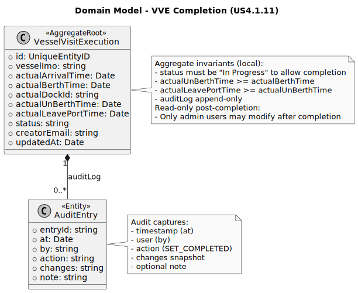

## 2. Analysis

### 2.1. Relevant Domain Model Excerpt

For US4.1.11, the relevant domain slice centers on **VesselVisitExecution (VVE)** and its relationship with **cargo operations**:

* **VesselVisitExecution (Aggregate Root)**
  Represents the actual execution of a vessel visit. Core attributes relevant for completion:

    * `actualArrivalTime`, `actualBerthTime`, `actualDockId`
    * `actualUnBerthTime`, `actualLeavePortTime` (to be set when marking completed)
    * `status` (must be `"In Progress"` to allow completion)
    * `auditLog` (records all changes with timestamp, user, action, changes, optional notes)
    * `creatorEmail` and `updatedAt`

* **AuditEntry (inside VVE)**
  Each modification is captured in an append-only audit log:

    * `at` (timestamp of change)
    * `by` (user making the change)
    * `action` (e.g., `"SET_COMPLETED"`)
    * `changes` (from/to snapshot of fields updated)
    * `note` (optional, e.g., discrepancy notes)

* **Cargo operations (cross-aggregate check)**
  * Must be fully completed before a VVE can be marked as completed.
  * Checked in the **controller/service layer** (not inside the domain aggregate), via `OperationPlanService` or similar.
  * Provides an external validation step ensuring system-wide operational consistency.

---

### 2.2. Other Remarks

* **Aggregate consistency vs. system consistency**

    * **Inside VesselVisitExecution (enforceable invariants):**
        * Status must be `"In Progress"` before marking completed
        * `actualUnBerthTime >= actualBerthTime`
        * `actualLeavePortTime >= actualUnBerthTime`
        * Audit entries must be append-only and immutable
    * **Across VVNs/resources (requires service checks):**
        * All cargo operations for the VVN must be completed before VVE completion
        * Any cross-aggregate business rules (e.g., overlapping dock occupancy) are **outside the VVE aggregate** and handled in the service/controller

* **Auditability**
    * Every completion action is logged in the `auditLog` with:
        * `changedAt` (timestamp)
        * `by` (updater email)
        * `action` (`"SET_COMPLETED"`)
        * `changes` (snapshot of previous vs new values)
        * Optional `note` (discrepancy, if applicable)

* **Domain vs DTO**
    * The VVE aggregate stores domain-specific fields and logs; DTOs returned by the API layer are projections including audit info.
    * `actualUnBerthTime` and `actualLeavePortTime` are only set during the completion flow.

* **Concurrency control**
    * VVE status and timestamps should be checked to avoid race conditions (optimistic concurrency using `updatedAt` or versioning).
    * Conflicting completion attempts can return `409 Conflict` or similar.

* **Service-layer responsibility**
    * Checking cargo operations completeness is done in the controller/service, **not in the domain**, to maintain aggregate purity.
    * The service then calls `VesselVisitExecution.setCompleted(...)` to apply state changes and log the action.

* **Read-only post-completion**
    * Once `status = "Completed"`, VVE becomes read-only for regular users.
    * Only authorized admin users can apply corrections (controlled via service/controller).
