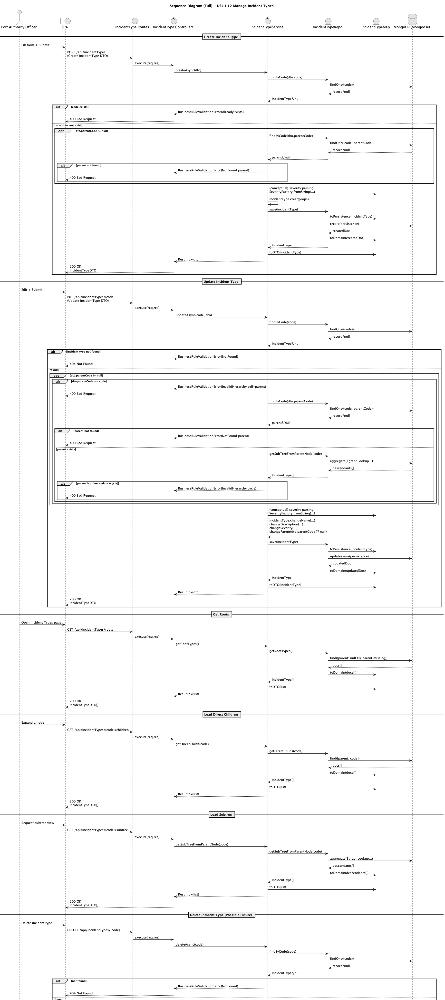
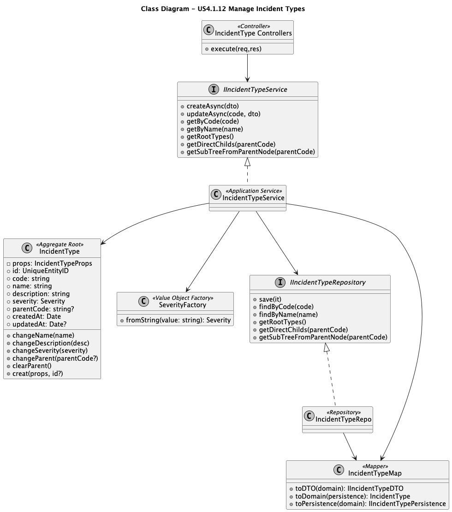

# US4.1.12 – Manage the catalog of Incident Types

## 3. Design – User Story Realization

### 3.1. Rationale

***Note that SSD – Alternative One is adopted (REST API + SPA, hierarchical catalog management).***

| Interaction ID | Question: Which class is responsible for…                                  | Answer                                                                                                                                                                             | Justification (with patterns)                                                                                                                                              |
| -------------- | -------------------------------------------------------------------------- | ---------------------------------------------------------------------------------------------------------------------------------------------------------------------------------- | -------------------------------------------------------------------------------------------------------------------------------------------------------------------------- |
| Step 1         | … interacting with the actor (Port Authority Officer via SPA)?             | **IncidentTypeRoutes / IncidentTypeController** (e.g., `CreatedITController`, `UpdateITController`, `GetITRootController`, `GetITDirectChildController`, `GetITSubTreeController`) | **Pure Fabrication**: endpoint layer created to receive HTTP requests and translate them into application calls; keeps UI/HTTP concerns out of domain.                     |
|                | … coordinating the use case?                                               | **IncidentTypeService**                                                                                                                                                            | **Application Service** (DDD): orchestrates workflow, enforces application-level rules (e.g., existence of parent, cycle prevention), delegates persistence to repository. |
| Step 2         | … validating request data (code, name, description, severity, parentCode)? | **Routes validation (Celebrate/Joi)** + **IncidentType domain**                                                                                                                    | **Validation at boundaries**: Joi handles syntactic validation; **Domain Model** enforces invariants (code format, severity via `SeverityFactory`, parent format).         |
| Step 3         | … checking if an Incident Type already exists (unique code)?               | **IncidentTypeRepo** (via `findByCode`)                                                                                                                                            | **Repository**: encapsulates data access; service uses repository to enforce uniqueness.                                                                                   |
| Step 4         | … constructing the domain object?                                          | **IncidentType** (`IncidentType.creat`) + **SeverityFactory**                                                                                                                      | **Creator / Factory**: domain factory method guarantees aggregate invariants; severity parsing centralized in a factory to avoid scattered checks.                         |
| Step 5         | … persisting the Incident Type?                                            | **IncidentTypeRepo** (`save`)                                                                                                                                                      | **Repository** pattern: abstracts MongoDB/Mongoose details; ensures persistence mapping and update-or-create logic.                                                        |
| Step 6         | … mapping between Domain ↔ Persistence ↔ DTO?                              | **IncidentTypeMap**                                                                                                                                                                | **Mapper (Pure Fabrication)**: prevents leaking persistence structures into domain and domain objects into API responses directly.                                         |
| Step 7         | … retrieving hierarchy data (roots, children, subtree)?                    | **IncidentTypeRepo** (`getRootTypes`, `getDirectChilds`, `getSubTreeFromParentNode`)                                                                                               | **Repository**: provides query methods optimized for MongoDB (`index` on `parent`, `$graphLookup` for subtree) while keeping services/Controllers persistence-agnostic.    |

#### Systematization

According to the taken rationale, the conceptual classes promoted to software classes are:

* **IncidentType** (Aggregate Root)
* **Severity** (Value Object / constrained type via `SeverityFactory`)

Other software classes (i.e., Pure Fabrication) identified:

* **IncidentTypeService** (Application Service)
* **IncidentTypeRepo** (Repository)
* **IncidentTypeMap** (Mapper)
* **Incident Type Controllers** (HTTP Controllers extending `BaseController`)
* **Incident Type Routes module** (Express router module)
* **Mongoose IncidentType Schema** (Persistence schema)

---

## 3.2. Sequence Diagram (SD)

### Full Diagram

The following sequence diagram covers the main flows required by this US:

## 3.3. Class Diagram (CD)

Below is a focused class diagram for this US (Domain + Application + Infrastructure bindings relevant to Incident Types).

