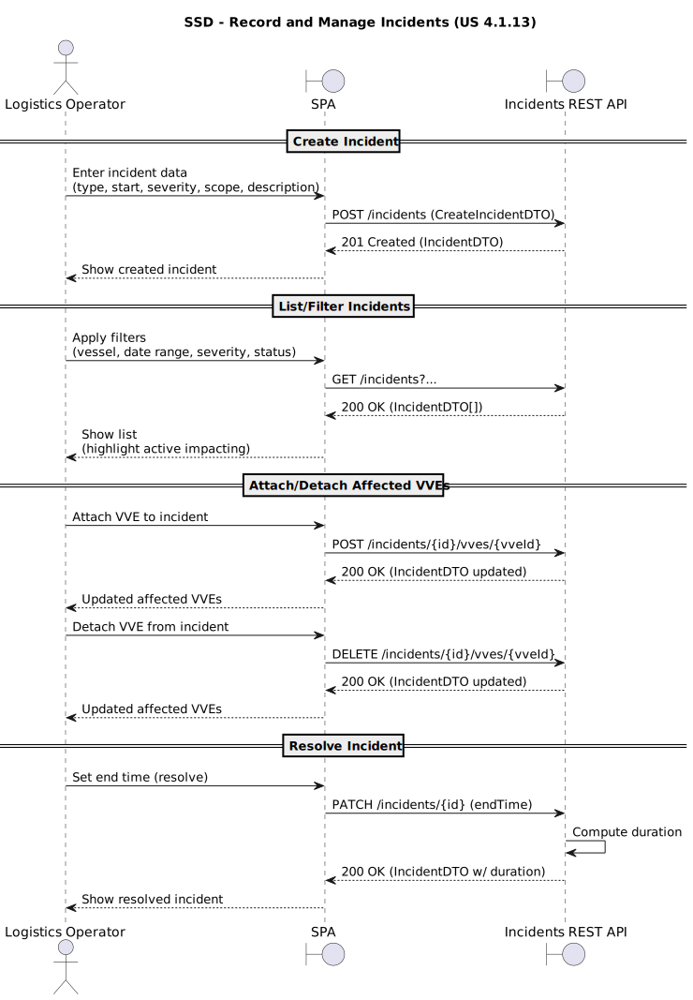

# US 4.1.13 - Record and manage incidents

## 1. Requirements Engineering

### 1.1. User Story Description

As a **Logistics Operator**, I want to **record and manage incidents** that affect the execution of port operations, so that **delays and operational disruptions** can be **accurately tracked, scoped, and analyzed**.

---

### 1.2. Customer Specifications and Clarifications

**From the specifications document and client meetings:**

* The system must provide **CRUD operations for Incidents** via the **REST API**.
* The **SPA** must allow:

    * **Filtering and listing** incidents by **vessel**, **date range**, **severity**, and **status** (active/resolved).
    * **Quickly associating/detaching** affected **VVEs**.
    * **Highlighting active incidents** currently impacting operations.
* Each Incident record must include:

    * **Unique generated ID** (system-generated)
    * Reference to an **Incident Type**
    * **Start** and **End** timestamps (end optional, allowing **ongoing/active** incidents)
    * **Severity** (e.g., minor/major/critical)
    * **Free-text description**
    * **Responsible user** (creator)
* An Incident may affect:

    1. **All ongoing VVEs**, or
    2. **Specific VVEs** (manually selected), or
    3. **Upcoming VVEs** (created later while the incident is still active).
* When an Incident is **resolved** (end timestamp set), its **duration must be computed automatically**.

**From forum (clarifications):**

> **Question:** Is there a specific format for the “unique codes” of Incident Types and Complementary Task Categories?
> **Answer:** Yes. These “unique codes” are **alphanumeric**, **user-defined**, and have **maximum 10 characters**.

> **Question:** Is there a specific format for the “unique generated IDs” of Incidents and Complementary Tasks?
> **Answer:** Yes. Generated IDs must follow the structure (using a separator such as “-”):
>
> * **Configurable constant prefix** (e.g., `"CT"` or `"INC"`)
> * **Year of occurrence** (e.g., 2025, 2026, …)
> * **Sequential number** padded with **leading zeros** (e.g., `"00001"`, `"00456"`)
    >   Examples:
> * `CT-2025-00456`, `CT-2025-07654`, `CT-2026-00001`
> * `INC-2025-00066`, `INC-2025-01001`, `INC-2026-00004`

> **Question:** If VVEs are created only when the vessel arrives (US 4.1.7), how does “(iii) upcoming VVEs” work?
> **Answer:** It emphasizes that, at incident registration time, it may be impossible to identify all affected VVEs. Therefore, later VVEs created meanwhile (e.g., via US 4.1.7) may need to be **added/removed** as affected VVEs.

> **Question:** Can a VVE be affected by more than one Incident at the same time? Can a VVE have multiple Complementary Tasks?
> **Answer:**
>
> 1. Yes, a VVE can be affected by **multiple incidents**, simultaneous or not.
> 2. Yes, a VVE can have **multiple complementary tasks** associated.

---

### 1.3. Acceptance Criteria

* **AC01 (API CRUD):** The REST API must provide **Create, Read, Update, and Delete** operations for Incidents.
* **AC02 (Incident data model):** Each Incident must contain:

    * a **unique generated ID** with format `INC-YYYY-NNNNN` (prefix configurable; year of occurrence; sequential with leading zeros),
    * a reference to an **Incident Type**,
    * **startTime** and **optional endTime**,
    * **severity** (minor/major/critical),
    * **description** (free text),
    * **createdBy** (responsible user/creator).
* **AC03 (Status logic):** If **endTime is null**, the Incident is **Active**; if **endTime is set**, the Incident is **Resolved**.
* **AC04 (Duration computation):** When endTime is set (incident resolved), the system must **automatically compute the duration** (`endTime - startTime`) and expose it in responses.
* **AC05 (Impact scope):** An Incident must support one of the following impact scopes:

    * affects **all ongoing VVEs**, or
    * affects **specific VVEs** selected by the user, or
    * affects **VVEs created later** while the incident remains active (“upcoming”).
* **AC06 (SPA filters):** The SPA must allow filtering/listing incidents by:

    * **vessel**,
    * **date range**,
    * **severity**,
    * **status** (active/resolved).
* **AC07 (VVE association management):** The SPA must allow the Logistics Operator to **quickly attach/detach VVEs** affected by an incident.
* **AC08 (Highlight impacting incidents):** The SPA must **highlight active incidents** that are currently impacting operations.
* **AC09 (Validation):** The system must reject:

    * incidents with `endTime < startTime`,
    * invalid scope payloads (e.g., “specific” without selected VVEs),
    * invalid Incident Type references.

---

### 1.4. Found out Dependencies

* **US 4.1.7 (VVE creation):** VVEs are created when a vessel arrives; incidents may need later association to VVEs created meanwhile (“upcoming” concept).
* **Incident Type management (catalog):** Incidents reference an existing Incident Type.
* **Vessel/VVE data availability:** Required to support filtering “by vessel” and scoping impacts to VVEs.
* **Authentication/Authorization:** Required to identify the **responsible user (creator)** and control access to operations.

---

### 1.5 Input and Output Data

**Input Data (Create/Update Incident):**

* `incidentTypeCode` or `incidentTypeId`
* `startTime`
* `endTime` (optional)
* `severity` (minor | major | critical)
* `description`
* `impactScopeMode`:

    * `ALL_ONGOING` | `SPECIFIC_VVES` | `UPCOMING`
* If `SPECIFIC_VVES`: `affectedVveIds[]`
* If `UPCOMING`: definition of “period/day” if modeled explicitly (or managed by later manual association)

**Input Data (Filters / List):**

* `vesselId` (or vessel selector)
* `fromDate`, `toDate`
* `severity`
* `status` (active/resolved)

**Input Data (Association management):**

* `incidentId`
* `vveId` to attach/detach (single or batch)

**Output Data (Incident DTO / list):**

* `incidentId` (e.g., `INC-2026-00004`)
* `incidentType` (id/code/name)
* `startTime`, `endTime`
* `status` (Active/Resolved)
* `duration` (computed if resolved)
* `severity`
* `description`
* `createdBy` (user id, optionally display name)
* `impactScopeMode`
* `affectedVVEs` (list or count)

---

### 1.6. System Sequence Diagram (SSD)

---

### 1.7 Other Relevant Remarks

* **Unique codes vs generated IDs**:

    * Incident Type codes are **user-defined alphanumeric** codes with **max 10 chars**.
    * Incident IDs are **system-generated** and must follow `PREFIX-YYYY-NNNNN` (prefix configurable, year of occurrence, sequential padded).
* **“Upcoming VVEs” operational meaning**:

    * It is expected that not all affected VVEs can be known at creation time; therefore, the Logistics Operator must be able to **add/remove** VVEs later, including VVEs created meanwhile (US 4.1.7).
* **Multiplicity rules**:

    * A VVE can be affected by **multiple incidents** (including simultaneously).
    * A VVE can have **multiple complementary tasks** associated.
