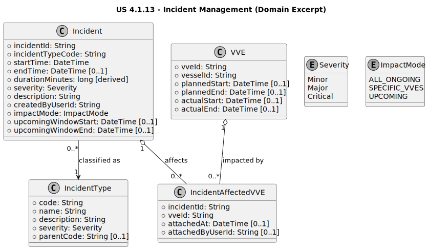

# US 4.1.13 – Record and manage incidents

## 2. Analysis

### 2.1. Relevant Domain Model Excerpt

Within the **Operational Disruptions / Incident Management** bounded context, the core concept introduced/extended by this user story is the **Incident** record and its impact scoping over **VVEs (Vessel Visit Executions)**.

#### Aggregate

**Incident (Aggregate Root)**
Represents an operational disruption event that may be ongoing or resolved, and that can impact multiple VVEs (including VVEs created after the incident is registered while it remains active).

**Attributes**

* `incidentId` (unique, **generated** identifier; format `INC-YYYY-NNNNN`, e.g., `INC-2026-00004`)
* `incidentTypeCode` (required; references **IncidentType** by unique code)
* `startTime` (timestamp)
* `endTime` (optional timestamp; `null` means **Active**)
* `duration` (derived; computed automatically when `endTime` is set)
* `severity` (enum: `Minor | Major | Critical`)
* `description` (free-text)
* `createdByUserId` (required; responsible user/creator)
* `impactMode` (enum: `ALL_ONGOING | SPECIFIC_VVES | UPCOMING`)
* `upcomingWindowStart` (optional; used when `impactMode=UPCOMING`, if you explicitly model a time window)
* `upcomingWindowEnd` (optional; used when `impactMode=UPCOMING`, if you explicitly model a time window)

> Note: The “UPCOMING” concept exists to reflect that not all affected VVEs can be known at registration time; affected VVEs can be added later (e.g., when new VVEs are created via US 4.1.7 while the incident remains active).

**Relationships**

* `IncidentType 1 ── 0..* Incident` (each Incident references exactly one IncidentType)
* `Incident 1 ── 0..* IncidentAffectedVVE` (association entity)
* `VVE 1 ── 0..* IncidentAffectedVVE` (a VVE can be affected by multiple incidents)
* `VVE 1 ── 0..* ComplementaryTask` (related constraint from clarifications; not owned by this US, but impacts the domain understanding)

**Association Entity (recommended)**

**IncidentAffectedVVE**
Represents the many-to-many link between Incidents and VVEs.

**Attributes**

* `incidentId`
* `vveId`
* `attachedAt` (optional)
* `attachedByUserId` (optional)

**Key invariants / business rules**

* `incidentId` must follow the generated ID pattern: `PREFIX-YYYY-NNNNN` with configurable prefix `INC`.
* `incidentTypeCode` must reference an existing **IncidentType**.
* `severity` must be one of the supported values (`Minor | Major | Critical`).
* If `endTime` is provided, it must satisfy `endTime >= startTime`.
* If `endTime` is set, `duration` must be computed automatically (`endTime - startTime`) and exposed on read.
* `impactMode` governs scoping:

    * `ALL_ONGOING`: incident affects all VVEs currently ongoing (at evaluation time).
    * `SPECIFIC_VVES`: affected VVEs are explicitly maintained via `IncidentAffectedVVE`.
    * `UPCOMING`: emphasizes that additional VVEs (created later while the incident is active) may need to be associated—either prompted by the system or added manually.
* A VVE **may be affected by more than one incident**, simultaneous or not (many-to-many).
* The `(incidentId, vveId)` pair in `IncidentAffectedVVE` must be **unique** (no duplicate links).

#### Domain excerpt (PlantUML class diagram)

---

### 2.2. Other Remarks

* **Persistence approach (MongoDB + Mongoose):**

    * Store `Incident` as its own collection with indexes on `incidentId`, `endTime` (for active queries), `severity`, `incidentTypeCode`, and timestamps.
    * Model `IncidentAffectedVVE` either as:

        * a separate collection (recommended for scalability and uniqueness constraints), or
        * an embedded array `affectedVveIds[]` inside `Incident` (simpler, but harder to enforce uniqueness and audit metadata like attachedAt/attachedBy).

* **Active impact highlighting:**

    * “Active” is `endTime=null`.
    * “Impacting operations” should be computed by intersecting `impactMode` with current/ongoing VVEs:

        * `ALL_ONGOING`: impacting if there exists at least one ongoing VVE now (or always impacting by definition—choose and document).
        * `SPECIFIC_VVES`: impacting if at least one linked VVE is currently ongoing.
        * `UPCOMING`: treat as impacting while active and within the configured time window/day/period (if modeled), and/or allow later association of VVEs created meanwhile.

* **Upcoming VVEs (alignment with US 4.1.7):**

    * The key requirement is **operational completeness over time**: incidents may start before all affected VVEs exist in the system. Therefore, the operator must be able to **add/remove** VVEs later, and the UI may optionally prompt on VVE creation when active incidents exist.

* **Deletion semantics (recommended):**

    * Allow deletion only if consistent with audit needs; otherwise prefer soft-delete or strict retention (incidents are typically audit-relevant).
    * If delete is allowed, ensure you also remove/handle `IncidentAffectedVVE` links to prevent orphan records.
