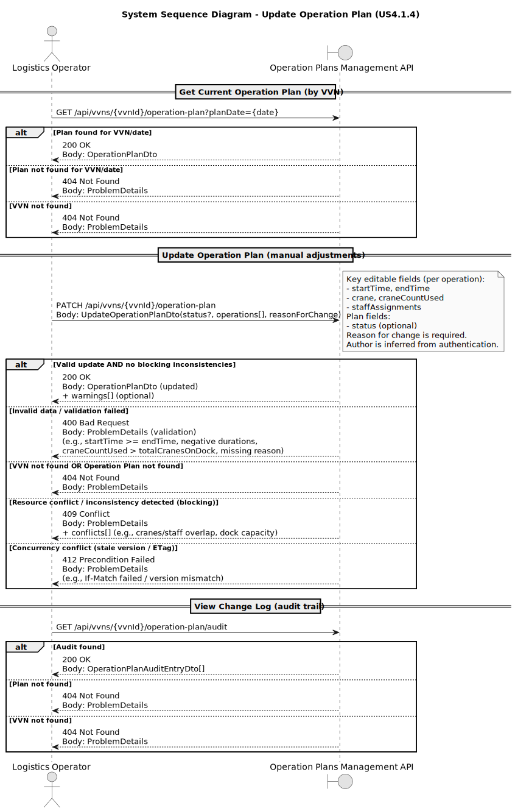

# US4.1.4 – Update the Operation Plan of a given VVN

## 1. Requirements Engineering

### 1.1. User Story Description

As a **Logistics Operator**, I want to **manually update the Operation Plan** of a given **VVN (Vessel Visit Notification)**, so that **last-minute adjustments** (e.g., crane/staff allocation or timing changes) can be applied when needed, while ensuring the plan remains **valid**, **audited**, and **consistent** with other VVNs and resource availability.

---

### 1.2. Customer Specifications and Clarifications

**From the specifications document and client meetings:**

* The system must expose **REST update endpoints** for Operation Plans.
* The SPA must support editing **key plan fields**, namely:

    * **Crane assignment** (crane identifier and/or number of cranes used)
    * **Start/End times** per operation
    * **Staff assignments**
* All changes must be:

    * **Validated**
    * **Logged** with **date**, **author**, and **reason**
* The system must **alert the user** if the update introduces likely **inconsistencies** with:

    * **Resource availability** (e.g., cranes/staff)
    * **Related VVNs** (e.g., time overlaps competing for the same dock/crane/staff)

**Clarifications to be assumed in implementation (pragmatic and testable):**

1. **Scope of update**

    * The operator updates an **existing** Operation Plan previously generated (by an algorithm or earlier manual edits).
    * Updates can be done at two levels:

        * **Plan-level** metadata (e.g., `status`)
        * **Operation-level** details inside `operations[]` (times, crane, staff)
2. **Reason is mandatory**

    * Any update must include a non-empty `reasonForChange`.
3. **Author is derived from authentication**

    * `author` should be the authenticated user (e.g., from JWT/session), not free text from the client.
4. **Audit records are append-only**

    * Each update produces a new audit entry; previous values must remain traceable.
5. **Conflicts generate warnings (and may block)**

    * The API returns a set of **warnings** when conflicts are detected.
    * Severe conflicts (e.g., exceeding crane capacity on a dock, or overlapping staff assignments that violate constraints) should return **409 Conflict** (blocking), while softer issues may return **200 OK with warnings** (non-blocking) depending on your policy. If you need one policy only: adopt **blocking for resource-capacity violations**, warnings for “potential” conflicts.

---

### 1.3. Acceptance Criteria

**AC01 — Update endpoints available (REST)**

* The system provides REST endpoints to update an Operation Plan for a given VVN.
* Must support updating at least: `operations[].startTime`, `operations[].endTime`, `operations[].crane`, `operations[].craneCountUsed`, and `operations[].staffAssignments`.

**AC02 — SPA editing**

* The SPA allows a Logistics Operator to select a VVN and open its Operation Plan.
* The SPA provides an edit mode for the key fields (times, crane assignment, staff assignments) and requires a **reason for change** before submitting.

**AC03 — Validation of submitted changes**

* Server-side validation rejects invalid updates with **400 Bad Request** and meaningful error messages.
* Minimum validation rules (aligned with your DTO fields):

    * `algorithm` non-empty (if editable; otherwise keep unchanged)
    * `operations` must exist (can be empty)
    * For every operation:

        * `startTime < endTime`
        * `loadingDuration >= 0`, `unloadingDuration >= 0`, `optimizedOperationDuration >= 0`
        * `craneCountUsed >= 0`
        * `craneCountUsed <= totalCranesOnDock` (if `totalCranesOnDock` is known/authoritative)
        * If `realArrivalTime` / `realDepartureTime` are present, enforce chronological consistency (e.g., arrival ≤ startTime; endTime ≤ departure), if applicable to your domain rules

**AC04 — Logging (date, author, reason, changes)**

* Every successful update produces an immutable audit log entry containing:

    * `changedAt` (server timestamp)
    * `author` (authenticated user id/name)
    * `reason`
    * A representation of changes (e.g., patch/diff or old/new snapshot summary)

**AC05 — Consistency and resource availability checks**

* On update, the system checks for conflicts with:

    * Other operations on the same dock (time overlaps)
    * Crane capacity per dock/time window
    * Staff assignments overlapping beyond allowed limits
* The system alerts the user:

    * Either by returning a structured list of warnings/conflicts in the API response
    * And presenting them in the SPA before final confirmation (or immediately after save)

**AC06 — Concurrency protection**

* If two operators update the same plan concurrently, the system detects it and prevents silent overwrites (e.g., using `ETag`/`If-Match`, a `version` field, or `updatedAt` checks).
* Conflicts return **409 Conflict** or **412 Precondition Failed** (depending on chosen mechanism).

---

### 1.4. Found out Dependencies

* **US4.2.1 – Operation Plans for all VVNs** (a plan must exist before it can be updated).
* **Resource catalog / availability sources**

    * Cranes per dock (capacity constraints)
    * Staff pool and assignment rules (availability constraints)
* **Authentication/Authorization**

    * To reliably populate `author` and enforce “Logistics Operator” permissions.
* (Optional but strongly recommended) **Operation line identification**

    * Your `IOperationDTO` currently has no `operationId`. Editing becomes fragile if you rely on array index.
    * Add `operationId: string` (or `domainId`) to each operation entry to support stable updates and auditing.

---

### 1.5. Input and Output Data

**Input Data (API request)**

* Identifiers:

    * `vvnId` (path param or inside payload)
    * `operationPlanId` (path param) — if plans are persisted separately
* Editable content (examples):

    * `status` (optional)
    * `operations[]` updates:

        * `startTime`, `endTime`
        * `crane`, `craneCountUsed`
        * `staffAssignments[]` (structure depends on your staff model)
* Audit:

    * `reasonForChange: string` (required)

**Output Data (API response)**

* Updated `IOperationPlanDTO` (or a dedicated response DTO)
* Metadata:

    * `createdAt`, `author` (author of the update or last editor—define clearly)
    * `updatedAt` (recommended)
    * `version`/`etag` (recommended)
* Consistency feedback:

    * `warnings: { code: string; message: string; relatedVvnIds?: string[]; severity: "info"|"warning"|"blocking" }[]`

---

### 1.6. System Sequence Diagram (SSD)

---

### 1.7. Other Relevant Remarks

* **DTO evolution recommendation:** introduce stable identifiers for operations:

    * `IOperationDTO.operationId: string`
    * Without this, auditing “which operation changed” and updating a single row becomes error-prone.
* **Domain alignment:** your current `OperationPlan` aggregate stores `operations` as DTOs (`IOperationDTO[]`). In a strict DDD approach, you typically model operations as **entities/value objects** inside the aggregate (and map to DTO at the boundary). If you keep DTOs internally for speed, compensate with:

    * Strong validation at aggregate creation/update
    * Clear invariants enforced in the service layer
* **Logging design:** implement an `OperationPlanChangeLog` (append-only) to satisfy traceability and compliance-style auditing:

    * `planId`, `vvnId`, `changedAt`, `author`, `reason`, `diff`
* **Alerting UX:** best practice is to show warnings *before* final save when possible (pre-check), but the authoritative check must still run server-side on save.
