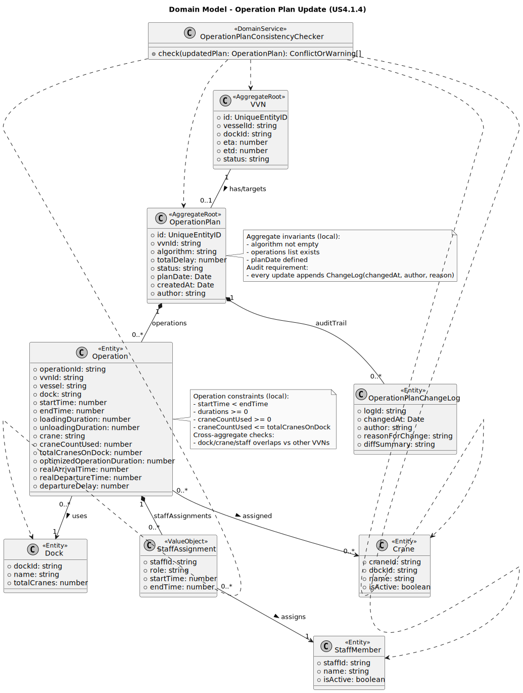

## 2. Analysis

### 2.1. Relevant Domain Model Excerpt

For US4.1.4, the relevant domain slice centers on **VVN** and its associated **Operation Plan** and operational resources:

* **VVN (Vessel Visit Notification)**
  Acts as the planning “anchor” (the plan exists *for* a given VVN, usually for a selected target day `planDate`). The update is always contextualized by `vvnId`.

* **OperationPlan (Aggregate Root)**
  Represents the operational schedule and allocations derived from an algorithm and/or manual adjustments. Core attributes (from your current model):

    * `algorithm`, `totalDelay`, `status`, `planDate`
    * `operations[]` (the sequence of operations/tasks composing the plan)
    * Audit metadata: `createdAt`, `author` (and, for updates, the updater should also be captured in an audit log)

* **Operation (inside the plan)**
  Each operation entry binds timing + resources + derived metrics:

    * Timing: `startTime`, `endTime`, `realArrivalTime`, `realDepartureTime`, `departureDelay`
    * Resources: `dock`, `crane`, `craneCountUsed`, `staffAssignments[]`
    * Context: `vvnId`, `vessel`
    * Constraints: `totalCranesOnDock`

* **Resources and constraints (cross-aggregate concerns)**

    * **Dock** capacity and time-slot usage (multiple VVNs may overlap on the same dock/day)
    * **Crane** availability and per-dock crane capacity (`craneCountUsed <= totalCranesOnDock`)
    * **Staff** availability and overlapping assignments (staff cannot be simultaneously assigned beyond allowed limits)

**DDD positioning:** `OperationPlan` is the natural **aggregate root** for the manual update use case because the update is about maintaining internal consistency of a plan (operations, timings, allocations) and emitting an auditable change. However, the “no conflicts with other VVNs/resources” rule is **not fully enforceable inside a single aggregate**, so it should be handled via a **Domain Service** (e.g., `OperationPlanConsistencyChecker`) that consults other schedules/calendars/repositories.

---

### 2.2. Other Remarks

* **Aggregate consistency vs. system consistency**

    * **Inside OperationPlan (invariants you can enforce locally):**

        * `algorithm` non-empty (or immutable after creation, depending on your policy)
        * `operations` list exists
        * For each operation: `startTime < endTime`, non-negative durations, `craneCountUsed >= 0`, and if `totalCranesOnDock` is authoritative, `craneCountUsed <= totalCranesOnDock`
    * **Across VVNs/resources (requires domain service checks):**

        * Overlaps on same dock and time windows
        * Crane capacity conflicts per dock/time
        * Staff overlapping assignments

* **Auditability is a first-class requirement**

    * The user story requires “validated and logged (date, author, reason)”. This is best modeled as an **append-only audit log** (either a separate `OperationPlanChangeLog` aggregate or an owned entity list in `OperationPlan`) capturing:

        * `changedAt`, `author`, `reasonForChange`, and a diff/snapshot of changes

* **Operations should have stable identity**

    * Your `IOperationDTO` does not include an `operationId`. For reliable updates and auditing (especially partial updates), each operation should have a stable identifier (e.g., `operationId: string`). Otherwise, updates become index-based and fragile.

* **DTO leakage into the domain**

    * Currently, the aggregate stores `IOperationDTO[]` directly. If you keep this approach, compensate with strong validation and clear invariants. If you want stricter DDD, model `Operation` as an internal entity/value object and map DTOs at the boundary.

* **Concurrency control**

    * Manual last-minute changes are prone to concurrent edits. Introduce `version`/`updatedAt` and enforce optimistic concurrency (`If-Match` / version checks), returning conflict responses when stale updates are attempted.

