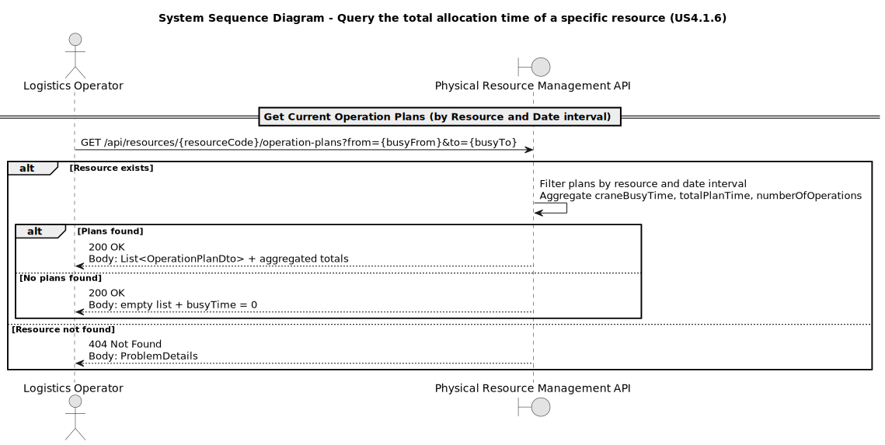

# USx - ???

## 1. Requirements Engineering

### 1.1. User Story Description
**From the specifications document and client meetings:**

As a **Logistics Operator**, I want to **query, for a given period, the total allocation time of a specific resource** (e.g., crane, dock, or staff), so that I can assess resource utilization and workload distribution.

### 1.2. Customer Specifications and Clarifications

**From the specifications document and client meetings:**

* None given.

### 1.3. Acceptance Criteria

* **AC01:** The REST API must **provide endpoints aggregating Operation Plan data by resource and period**.
* **AC02:** Returned data must include **total allocated time and number of operations**.
* **AC03:** The SPA must **display results in a summary table**.
* **AC04:** Data must **only include saved Operation Plans**.

### 1.4. Found out Dependencies

* **2.2.12**, a physical resource must exist
* **3.4.4**, a planning algorithm must exist
* **4.1.2**, a plan must exist to determine allocation of physical resoruces

### 1.5 Input and Output Data

**Input Data:**

**Output Data:**

### 1.6. System Sequence Diagram (SSD)

### 1.7 Other Relevant Remarks

* **Expansion of considered physical resources**, allocation of other physical resources other than cranes should be implemented in the future.