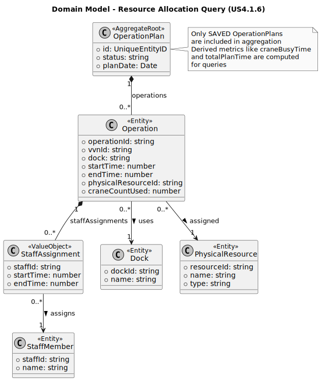

## 2. Analysis

### 2.1. Relevant Domain Model Excerpt

For US4.1.6, the relevant domain slice focuses on **OperationPlan** and its contained **Operations**, used as the source of truth for resource allocation data over time.

* **OperationPlan (Aggregate Root)**
  Represents the operational schedule and allocations derived from an algorithm and/or manual adjustments. Core attributes (from your current model):

    * `algorithm`, `totalDelay`, `status`, `planDate`
    * `operations[]` (the sequence of operations/tasks composing the plan)
    * Audit metadata: `createdAt`, `author` (and, for updates, the updater should also be captured in an audit log)

* **Operation (inside the plan)**
  Each operation entry binds timing + resources + derived metrics:

    * Timing: `startTime`, `endTime`, `realArrivalTime`, `realDepartureTime`, `departureDelay`
    * Resources: `dock`, `crane`, `craneCountUsed`, `staffAssignments[]`
    * Context: `vvnId`, `vessel`
    * Constraints: `totalCranesOnDock`

* **Resources and constraints (cross-aggregate concerns)**

    * **Dock** capacity and time-slot usage (multiple VVNs may overlap on the same dock/day)
    * **Crane** availability and per-dock crane capacity (`craneCountUsed <= totalCranesOnDock`)
    * **Staff** availability and overlapping assignments (staff cannot be simultaneously assigned beyond allowed limits)

**DDD positioning:** `OperationPlan` is the aggregate root providing data. This use case MUST be implemented outside the aggregate, as a query-oriented service or read model.

---

### 2.2. Other Remarks

* **Aggregate consistency vs. system consistency**

    * No consistency rules are enforced by this use case.
    * All validation is assumed to have happened at plan creation/update.

* **Auditability is a first-class requirement**

    * No audit logging is required.
    * The use case does not mutate domain state.

* **Performance considerations**

    * Aggregation may span many OperationPlans.
    * A denormalized read model or database-level aggregation may be required for efficiency.

