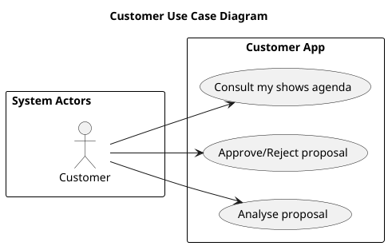

# Main Use Case Diagram (UCD)

# Customer Use Case Diagram (UCD)

# Use Cases / User Stories

| UC/US | Description                                                                                |                   
|:------|:-------------------------------------------------------------------------------------------|
| US101 | [Technical constraints](../../sprint1/us101/01.requirements-engineering/Readme.md)         |
| US102 | [Project repository](../../sprint1/us102/01.requirements-engineering/Readme.md)            |
| US103 | [Project structure](../../sprint1/us103/01.requirements-engineering/Readme.md)             |
| US104 | [Continuous integration server](../../sprint1/us104/01.requirements-engineering/Readme.md) |
| US105 | [Automated deployment](../../sprint1/us105/01.requirements-engineering/Readme.md)          |
| US110 | [ Domain model](../../sprint1/us110/01.requirements-engineering/Readme.md)                 |

