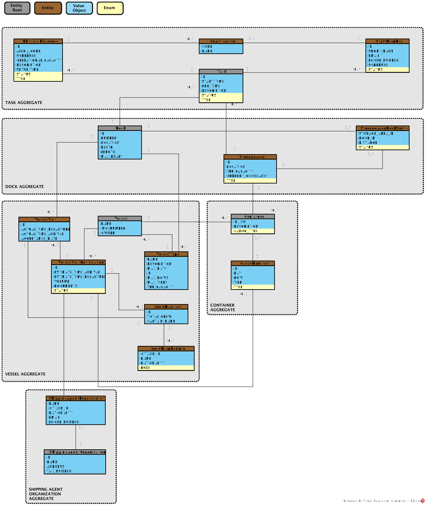

# OO Analysis

## Rationale to identify domain conceptual classes

### *Conceptual Class Category List*

**Business Transactions**

* Vessel Visit Notification (VVN)
* Vessel Visit Decision (Approval/Rejection)

---

**Transaction Line Items**

* Cargo Manifest Entry (load/unload container)

---

**Product/Service related to a Transaction or Transaction Line Item**

* Cargo (Container)
* Crew Member (in context of visit/security checks)

---

**Transaction Records**

* Vessel Visit Notification Record (with decision logs)
* Cargo Manifest Record

---

**Roles of People or Organizations**

* Port Authority Officer
* Shipping Agent Representative
* Shipping Agent Organization
* Staff Member (operational role)

---

**Places**

* Dock
* Storage Area (Yard / Warehouse)
* Port (as context, can be abstracted)

---

**Noteworthy Events**

* Vessel Visit Notification Submitted
* Vessel Visit Notification Approved
* Vessel Visit Notification Rejected
* Dock Temporarily Assigned
* Storage Area Occupancy Updated

---

**Physical Objects**

* Vessel
* Resource (e.g., crane, truck, mobile equipment)

---

**Descriptions of Things**

* Vessel Type (constraints: bays, rows, tiers, capacity)
* Qualification (skills/certifications for staff/resources)

---

**Catalogs**

* Catalog of Vessel Types
* Catalog of Qualifications

---

**Containers**

* Storage Area (as container of Cargo)
* Vessel (as container of Cargo, Crew)

---

**Elements of Containers**

* Container (TEU/ISO 6346 ID)
* Cargo Manifest Entry
* Crew Member

---

**Organizations**

* Shipping Agent Organization
* Port Authority

---

**Other External/Collaborating Systems**

* External RDBMS (for persistence)
* Notification Service (email/SMS for VVN decisions)

---

**Records of finance, work, contracts, legal matters**

* Not directly covered in Sprint A (may appear in future Sprints as contracts/billing).

---

**Financial Instruments**

* No direct relevance in Sprint A.

---

**Documents mentioned/used to perform some work**

* Integrative Project Assignment (EN) – Versions 1 to 1.2 (to be updated)
* Cargo Manifest (document with container list)
* Crew List (document with crew IDs)

---

## Rationale to identify associations between conceptual classes

| Concept (A)               | Association            | Concept (B)                   |
| ------------------------- | ---------------------- | ----------------------------- |
| Vessel                    | is classified by       | Vessel Type                   |
| Vessel                    | is registered by       | Shipping Agent Organization   |
| Vessel Visit Notification | refers to              | Vessel                        |
| Vessel Visit Notification | submitted by           | Shipping Agent Representative |
| Vessel Visit Notification | approved/rejected by   | Port Authority Officer        |
| Vessel Visit Notification | includes               | Cargo Manifest                |
| Cargo Manifest Entry      | describes container in | Container                     |
| Dock                      | can berth              | Vessel (of allowed types)     |
| Storage Area              | serves                 | Dock(s)                       |
| Storage Area              | contains               | Container(s)                  |
| Staff Member              | has                    | Qualification(s)              |
| Resource                  | requires               | Qualification(s)              |
| Resource                  | assigned to            | Storage Area (or Dock)        |
| Port Authority Officer    | manages                | Vessel Visit Decision         |

---

## Domain Model

Below is a conceptual Domain Model diagram (to be exported with PlantUML/other tool).

